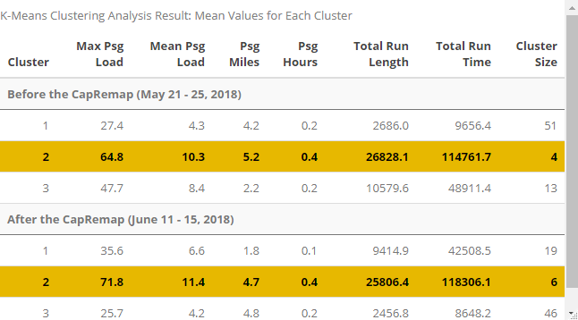

<style>
.superbigimage{
overflow-x:scroll;
white-space: nowrap;
}
.superbigimage img{
max-width: none;
}
</style>

```{r setup, include=FALSE}
knitr::opts_chunk$set(
	echo = TRUE,
	fig.align = "center",
	message = FALSE,
	warning = FALSE,
	cache = FALSE,
	results = FALSE
)
options(scipen=99)
```

# 1. Introduction

## Setup

```{r}
library(tidyverse)
library(sf)
library(QuantPsyc)
library(RSocrata)
library(viridis)
library(caret)
library(spatstat)
library(spdep)
library(FNN)
library(grid)
library(gridExtra)
library(knitr)
library(kableExtra)
library(tidycensus)
library(nnet)
library(reshape2)
library(class)
library(MASS)
library(dplyr)
library(tidyr)
library(lubridate)
library(plotly)
library(ggmap)
library(data.table)
library(gganimate)
library(corrplot)
library(stargazer)
library(tigris)
library(ckanr)
library(ggplot2)
library(metR)
library(magrittr)
library(NbClust)
library(cowplot)
library(flexclust)
library(vwline)
library(RColorBrewer)
```

```{r}
mapTheme <- function(base_size = 12) {
  theme(
    text = element_text( color = "black"),
    plot.title = element_text(size = 14,colour = "black"),
    plot.subtitle=element_text(face="italic"),
    plot.caption=element_text(hjust=0),
    axis.ticks = element_blank(),
    panel.background = element_blank(),axis.title = element_blank(),
    axis.text = element_blank(),
    axis.title.x = element_blank(),
    axis.title.y = element_blank(),
    panel.grid.minor = element_blank(),
    panel.border = element_rect(colour = "black", fill=NA, size=2)
  )
}

qBr <- function(df, variable, rnd) {
  if (missing(rnd)) {
    as.character(quantile(round(df[[variable]],0),
                          c(.01,.2,.4,.6,.8), na.rm=T))
  } else if (rnd == FALSE | rnd == F) {
    as.character(formatC(quantile(df[[variable]]), digits = 3),
                 c(.01,.2,.4,.6,.8), na.rm=T)
  }
}

q5 <- function(variable) {as.factor(ntile(variable, 5))}

plotTheme <- theme(
  plot.title =element_text(size=12),
  plot.subtitle = element_text(size=8),
  plot.caption = element_text(size = 6),
  axis.text.x = element_text(size = 10, angle = 45, hjust = 1),
  axis.text.y = element_text(size = 10),
  axis.title.y = element_text(size = 10),
  # Set the entire chart region to blank
  panel.background=element_blank(),
  plot.background=element_blank(),
  axis.ticks=element_blank())

plotTheme <- function(base_size = 12) {
  theme(
    text = element_text( color = "black"),
    plot.title = element_text(size = 14,colour = "black"),
    plot.subtitle = element_text(face="italic"),
    plot.caption = element_text(hjust=0),
    axis.ticks = element_blank(),
    panel.background = element_blank(),
    panel.grid.major = element_line("grey80", size = 0.1),
    panel.grid.minor = element_blank(),
    panel.border = element_rect(colour = "black", fill=NA, size=1.5),
    strip.background = element_rect(fill = "grey80", color = "white"),
    strip.text = element_text(size=12),
    axis.title = element_text(size=12),
    axis.text = element_text(size=10),
    plot.background = element_blank(),
    legend.background = element_blank(),
    legend.title = element_text(colour = "black", face = "italic"),
    legend.text = element_text(colour = "black", face = "italic"),
    strip.text.x = element_text(size = 14)
  )
}

nn_function <- function(measureFrom,measureTo,k) {
  
  nn <-   
    FNN::get.knnx(measureTo, measureFrom, k)$nn.dist
  
  output <-
    as.data.frame(nn) %>%
    rownames_to_column(var = "thisPoint") %>%
    gather(points, point_distance, V1:ncol(.)) %>%
    arrange(as.numeric(thisPoint)) %>%
    group_by(thisPoint) %>%
    summarize(pointDistance = mean(point_distance)) %>%
    arrange(as.numeric(thisPoint)) %>% 
    dplyr::select(-thisPoint)
  
  return(output)  
}
```

## Background

Cap Remap comes from a 10-year transit plan: Connections 2025. It aims to adjust the transit network according to internal analysis about what works the best and community outreach. It also aims to improve the east-west connection. 

Passengers can buy their passes on the CapMetro app directly. The new network will cause more transfers to passengers but overall less waiting time. A single ride pass is \$1.25. For a Day-Pass, it is \$2.5 which allows a passenger to ride for unlimited times in 24 hours. They also have options for 7-day passes or monthly pass.

- More frequent, more reliable and better connected
- Triple the number of bus routes that operate every 15min
- Make sure the frequency meets the need on weekends
- Link to [High-Frequency Service Map](https://capmetro.org/uploadedFiles/New2016/Plan_Your_Trip/Schedules_and_Maps/high-frequency-system-map.pdf): shows the routes operate every 15min

## Capital Metro Overview

Capital Metropoitan Transportation Authority (CapMetro), a public transportation agency that provides services include bus, paratransit services and a commuter rail system in Austin, Travis and parts of Williamson Counties, launched a major bus system overhaul emerged from Cap Metro's 10-year transit plan, "Connections 2025," called "Cap Remap." The objective of Cap Remap is to make the buses more frequent, more reliable, and better connected.

## Cap Remap
The following maps provide a general overview on the bus network changes before and after the Cap Remap. Overall, there is only a few changes in route coverage - only a route that goes to the west side of Austin was removed and a few other minor adjustment happened in the south region. However, the second map demonstrates that major changes occurred on the types of routes or route configurations in the system. In general, new routes and high frequency routes were introduced throughout the City while most eliminated routes are replaced.  Since there is a lack of information on what types of analysis was done to guide the route change, we could only suspect that ridership and other built environment characteristics were some of the major factors in such an overhaul of the bus system. More explorations will be illustrated in later sections on factors that can influence ridership.

## Use Case
With the interests in how ridership is influenced by bus rerouting, we intend to design a tool for planners to test the impact of a built environment and/or bus system change scenario has on bus ridership in Austin and to plan bus routes and schedules accordingly.


```{r load data}
setwd('C:/Users/HanyongXu/Documents/Me/grad/Spring_2020/MUSA801')
Routes1801 <- st_read("Data/Shapefiles_-_JANUARY_2018/Routes.shp")
serviceArea <- st_read('Data/Shapefiles_-_JUNE_2018/Service_Area.shp')
NewRoutes <- st_read('Data/Jia/NewRoutes.shp')
HighFreq <- st_read('Data/Jia/HighFrequency.shp')
Replaced <- st_read('Data/Jia/EliminatedReplacement.shp')
Eliminated <- st_read('Data/Jia/Eliminated.shp')
Routes2001 <- st_read('Data/Jia/Routes2001.shp')
```

```{r processing}
Routes1801 <- Routes1801%>%
  mutate(capremap = "Before Cap Remap")

Routes2001 <- Routes2001%>%
  mutate(capremap = "After Cap Remap")
```

```{r overview map}
ggplot()+
  geom_sf(data = serviceArea, aes(fill = "Service Areas"))+
  geom_sf(data = subset(serviceArea, NAME == "Austin"), aes(fill = "Austin"))+
  scale_fill_manual(values = c("Service Areas" = "gray25", "Austin" = "black"), name = NULL,
                    guide = guide_legend("Jurisdictions", override.aes = list(linetype = "blank", shape = NA))) +
  geom_sf(data = Eliminated, aes(color = "Eliminated Routes"), lwd = 0.5, show.legend = "line")+
  geom_sf(data = Replaced, aes(color = "Eliminated but Replaced Routes"),lwd = 0.5, show.legend = "line")+
  geom_sf(data = HighFreq, aes(color = "High Frequency Routes"), lwd = 0.8, show.legend = "line")+
  geom_sf(data = NewRoutes, aes(color = "New Routes"),lwd = 0.8, show.legend = "line")+
  scale_colour_manual(values = c("Eliminated Routes" = "darkorange", "Eliminated but Replaced Routes" = "gold", "High Frequency Routes" = "dodgerblue", "New Routes" = "deeppink"),
                      guide = guide_legend("Routes", override.aes = list(linetype = c("solid", "solid", "solid", "solid"), shape = c(NA, NA, NA, NA))))+
  labs(title = "Cap Remap Route Changes",
       subtitle = "City of Austin, June 2018")
```

## Changes on Route Types
### Major Changes

This section will introduce the types of routes in CapMetro's bus system and what changes Cap Remap has made on the route types.

The two most common types of routes are Local and High Frequency.CapMetro's Local routes are intended to connect specific neighborhoods of Austin to Downtown Austin, with frequent stops. High Frequency routes are similar to Local routes in terms of the connections and frequent stops. Yet, as the name suggested, the headway, which is the time between each bus arrival, is much shorter.

To be more specific, Cap Remap has expanded a high frequency network that include multiple bus routes that run every 15 minutes from 6 a.m. to 8 p.m., 7 days a week.From the comparisons between changes on local routes and changes on high frequency routes, it is obvious that after Cap Remap, the number of local routes decreased whereas the coverage of high frequency routes expanded.

```{r major change route types}
local <- ggplot()+
  geom_sf(data = serviceArea, aes(fill = "Service Areas"))+
  geom_sf(data = subset(serviceArea, NAME == "Austin"), aes(fill = "Austin"))+
  scale_fill_manual(values = c("Service Areas" = "gray25", "Austin" = "black"), name = NULL,
                    guide = guide_legend("Jurisdictions", override.aes = list(linetype = "blank", shape = NA))) +
  geom_sf(data = subset(Routes1801, ROUTETYPE == "Local"), color = "lightblue2",lwd = 0.8,show.legend = FALSE)+
  geom_sf(data = subset(Routes2001, ROUTETYPE == "Local"), color = "lightblue2",lwd = 0.8,show.legend = FALSE)+
  #scale_colour_manual(values = c("Before Cap Remap" = "lightblue2", "After Cap Remap" = "lightblue2"),
                      #guide = guide_legend("Routes", override.aes = list(linetype = c("solid", "solid"))))+
  facet_grid(~capremap)+
  labs(title = "Local Routes Before and After Cap Remap")

#HighFrequency
highFrequency <- ggplot()+
  geom_sf(data = serviceArea, aes(fill = "Service Areas"))+
  geom_sf(data = subset(serviceArea, NAME == "Austin"), aes(fill = "Austin"))+
  scale_fill_manual(values = c("Service Areas" = "gray25", "Austin" = "black"), name = NULL,
                    guide = guide_legend("Jurisdictions", override.aes = list(linetype = "blank", shape = NA))) +
  geom_sf(data = subset(Routes1801, ROUTETYPE == "High Frequency"), color = "dodgerblue",lwd = 0.8,show.legend = FALSE)+
  geom_sf(data = subset(Routes2001, ROUTETYPE == "High Frequency"), color = "dodgerblue",lwd = 0.8,show.legend = FALSE)+
  #scale_colour_manual(values = c("Before Cap Remap" = "dodgerblue", "After Cap Remap" = "dodgerblue"),
                      #guide = guide_legend("Routes", override.aes = list(linetype = c("solid", "solid"))))+
  facet_grid(~capremap)+
  labs(title = "High Frequency Routes Before and After Cap Remap")

#major changes grid arrange
grid.arrange(local, highFrequency, ncol = 1)

```

### Minor Changes

Crosstown, Feeder, Flyer,and MetroRapid routes only have minor changes. Crosstown routes are local services between two neighborhoods of Austin, for which the route does not pass through Downtown Austin or the University of Texas. Crosstown routes are designated by routes 300-399.Feeder routes are local services between a neighborhood and a major transfer point for connecting service. Feeder routes are designated by routes 200-299. Flyer routes are limited stop services between two destinations and they serve nonstop between downtown or the UT campus and their neighborhoods of service.Flyer routes are designated by routes 100-199.Express services are limited stop services that run between Downtown Austin and the far suburbs. Express routes are designated as routes 900-999. Special services are routes that do not fit in any other category. Special Services are designated as routes 400-499, with the exception of Round Rock service, which instead designates routes as 50-99. 
The minor changes don't compromise the system's overall coverage. Instead, most of those minor changes are either replaced by High Frequency routes.

```{r minor change route types, fig.width = 25, fig.height= 10}
#Crosstown
crosstown <-ggplot()+
  geom_sf(data = serviceArea, aes(fill = "Service Areas"))+
  geom_sf(data = subset(serviceArea, NAME == "Austin"), aes(fill = "Austin"))+
  scale_fill_manual(values = c("Service Areas" = "gray25", "Austin" = "black"), name = NULL,
                    guide = guide_legend("Jurisdictions", override.aes = list(linetype = "blank", shape = NA))) +
  geom_sf(data = subset(Routes1801, ROUTETYPE == "Crosstown"), color = "greenyellow",lwd = 0.8,show.legend = FALSE)+
  geom_sf(data = subset(Routes2001, ROUTETYPE == "Crosstown"), color = "greenyellow",lwd = 0.8,show.legend = FALSE)+
  #scale_colour_manual(values = c("Before Cap Remap" = "greenyellow", "After Cap Remap" = "greenyellow"),
                      #guide = guide_legend("Routes", override.aes = list(linetype = c("solid", "solid"))))+
  facet_grid(~capremap)+
  labs(title = "Crosstown Routes Before and After Cap Remap")

#Feeder
feeder <-ggplot()+
  geom_sf(data = serviceArea, aes(fill = "Service Areas"))+
  geom_sf(data = subset(serviceArea, NAME == "Austin"), aes(fill = "Austin"))+
  scale_fill_manual(values = c("Service Areas" = "gray25", "Austin" = "black"), name = NULL,
                    guide = guide_legend("Jurisdictions", override.aes = list(linetype = "blank", shape = NA))) +
  geom_sf(data = subset(Routes1801, ROUTETYPE == "Feeder"), color = "lightcoral",lwd = 0.8, show.legend = FALSE)+
  geom_sf(data = subset(Routes2001, ROUTETYPE == "Feeder"), color = "lightcoral",lwd = 0.8, show.legend = FALSE)+
  #scale_colour_manual(values = c("Before Cap Remap" = "lightcoral", "After Cap Remap" = "lightcoral"))+
                      #guide = guide_legend("Routes", override.aes = list(linetype = c("solid", "solid"))))+
  facet_grid(~capremap)+
  labs(title = "Feeder Routes Before and After Cap Remap")


#Flyer
flyer <- ggplot()+
  geom_sf(data = serviceArea, aes(fill = "Service Areas"))+
  geom_sf(data = subset(serviceArea, NAME == "Austin"), aes(fill = "Austin"))+
  scale_fill_manual(values = c("Service Areas" = "gray25", "Austin" = "black"), name = NULL,
                    guide = guide_legend("Jurisdictions", override.aes = list(linetype = "blank", shape = NA))) +
  geom_sf(data = subset(Routes1801, ROUTETYPE == "Flyer"), color = "magenta2",lwd = 0.8,show.legend = FALSE)+
  geom_sf(data = subset(Routes2001, ROUTETYPE == "Flyer"), color = "magenta2",lwd = 0.8,show.legend = FALSE)+
  #scale_colour_manual(values = c("Before Cap Remap" = "magenta2", "After Cap Remap" = "magenta2"),
                     # guide = guide_legend("Routes", override.aes = list(linetype = c("solid", "solid"))))+
  facet_grid(~capremap)+
  labs(title = "Flyer Routes Before and After Cap Remap")

#Express
express <-ggplot()+
  geom_sf(data = serviceArea, aes(fill = "Service Areas"))+
  geom_sf(data = subset(serviceArea, NAME == "Austin"), aes(fill = "Austin"))+
  scale_fill_manual(values = c("Service Areas" = "gray25", "Austin" = "black"), name = NULL,
                    guide = guide_legend("Jurisdictions", override.aes = list(linetype = "blank", shape = NA))) +
  geom_sf(data = subset(Routes1801, ROUTETYPE == "Express"), color = "red",lwd = 0.8,show.legend = FALSE)+
  geom_sf(data = subset(Routes2001, ROUTETYPE == "Express"), color = "red",lwd = 0.8,show.legend = FALSE)+
  #scale_colour_manual(values = c("Before Cap Remap" = "red", "After Cap Remap" = "red"),
                      #guide = guide_legend("Routes", override.aes = list(linetype = c("solid", "solid"))))+
  facet_grid(~capremap)+
  labs(title = "Express Routes Before and After Cap Remap")

#Special
special <- ggplot()+
  geom_sf(data = serviceArea, aes(fill = "Service Areas"))+
  geom_sf(data = subset(serviceArea, NAME == "Austin"), aes(fill = "Austin"))+
  scale_fill_manual(values = c("Service Areas" = "gray25", "Austin" = "black"), name = NULL,
                    guide = guide_legend("Jurisdictions", override.aes = list(linetype = "blank", shape = NA))) +
  geom_sf(data = subset(Routes1801, ROUTETYPE == "Special"), color = "seashell2",lwd = 0.8,show.legend = FALSE)+
  geom_sf(data = subset(Routes2001, ROUTETYPE == "Special"), color = "seashell2",lwd = 0.8,show.legend = FALSE)+
  #scale_colour_manual(values = c("Before Cap Remap" = "seashell2", "After Cap Remap" = "seashell2"),
   #                   guide = guide_legend("Routes", override.aes = list(linetype = c("solid", "solid"))))+
  facet_grid(~capremap)+
  labs(title = "Speical Routes Before and After Cap Remap")

#minor changes grid arrange

grid.arrange(crosstown, feeder, flyer, express, ncol =2)
```

### No Change

University of Texas Shuttle (UT Shuttle) services and Night Owl service didn't experience any changes.

UT Shuttle is operated by CapMetro and serves UT students, faculty, and staff at no charge with a valid UT photo ID. It is also open to the general public with normal bus rates.
Night Owl services are simply overnight routes.


``` {r no change route types, fig.width = 25, fig.height= 10}
#UT Shuttle
UTShuttle <- ggplot()+
  geom_sf(data = serviceArea, aes(fill = "Service Areas"))+
  geom_sf(data = subset(serviceArea, NAME == "Austin"), aes(fill = "Austin"))+
  scale_fill_manual(values = c("Service Areas" = "gray25", "Austin" = "black"), name = NULL,
                    guide = guide_legend("Jurisdictions", override.aes = list(linetype = "blank", shape = NA))) +
  geom_sf(data = subset(Routes1801, ROUTETYPE == "UT Shuttle"), color = "orange",lwd = 0.8,show.legend = FALSE)+
  geom_sf(data = subset(Routes2001, ROUTETYPE == "UT Shuttle"), color = "orange",lwd = 0.8,show.legend = FALSE)+
  #scale_colour_manual(values = c("Before Cap Remap" = "orange", "After Cap Remap" = "orange"),
                      #guide = guide_legend("Routes", override.aes = list(linetype = c("solid", "solid"))))+
  facet_grid(~capremap)+
  labs(title = "UT Shuttle Before and After Cap Remap")

#Nigh Owl
nightowl <- ggplot()+
  geom_sf(data = serviceArea, aes(fill = "Service Areas"))+
  geom_sf(data = subset(serviceArea, NAME == "Austin"), aes(fill = "Austin"))+
  scale_fill_manual(values = c("Service Areas" = "gray25", "Austin" = "black"), name = NULL,
                    guide = guide_legend("Jurisdictions", override.aes = list(linetype = "blank", shape = NA))) +
  geom_sf(data = subset(Routes1801, ROUTETYPE == "Night Owl"), color = "slategray2",lwd = 0.8,show.legend = FALSE)+
  geom_sf(data = subset(Routes2001, ROUTETYPE == "Night Owl"), color = "slategray2",lwd = 0.8,show.legend = FALSE)+
  #scale_colour_manual(values = c("Before Cap Remap" = "slategray2", "After Cap Remap" = "slategray2"),
   #                   guide = guide_legend("Routes", override.aes = list(linetype = c("solid", "solid"))))+
  facet_grid(~capremap)+
  labs(title = "Nigh Owl Routes Before and After Cap Remap")

#no change grid arrange
grid.arrange(UTShuttle, special, nightowl, ncol = 2)
```

# 2. Exploratory Analysis - What is the ridership typology?

## How did ridership change before and after CapRemap (06/03, 2018)?

### Citywide Ridership Change
```{r}
setwd('C:/Users/HanyongXu/Documents/Me/grad/Spring_2020/MUSA801')
data = read.csv('Data/MUSA Data - Stop Ridership Aggregated.csv')

table(data$YEAR_ID)
#Subset data in 2018 for further analysis
data.y18 <- data %>%
  subset(data$YEAR_ID == "2018")
```

```{r}
#Change June to 0 and make months before CapRemap become negative, after CapRemap become positive
data.y18$MONTH_ID <- as.numeric(data.y18$MONTH_ID)

data.y18$Month <- data.y18$MONTH_ID - 6
#Make month column become factor
#data.y18$Month <- factor( data.y18$Month, levels = c( "-5", "-4", "-3", "-2", "-1", "0", "1", "2", "3", "4", "5", "6") )

data.y18$Before <- ifelse(data.y18$Month < 0, 1, 0)

data.y19 <- data %>%
  subset(data$YEAR_ID == 2019)
data.y19$Month <- data.y19$MONTH_ID - 6

data.y19$Before <- ifelse(data.y19$Month < -5, 1, 0)

data.y <- rbind(data.y18, data.y19)
data.y$YEAR_ID <- as.factor(data.y$YEAR_ID)

table(data$YEAR_ID, data$MONTH_ID)

```
Current available data from Capital Metro allows us to observe the trend in ridership change before and after Cap Remap. The first important part of exploratory analysis is to see the city-wide change in ridership brought by CapRemap. With the stop-level data from Janurary 2018 to June 2019, the aggregated city-wide ridership change is shown in the chart below.

The x-axis represents month, and y-axis repredents the average daily ridership in the given month. The solid lines in the chart are 2018 riderships. The yellow solid line is ridership from Janurary to May in 2018 (before Cap Remap happened in June 2018) while the blue solid line is ridership from June to December in 2018 (after CapRemap). The dashed line is the ridership in 2019 from Janurary to June after CapRemap happend the year before. 

From the trend in 2018, it is clear that ridership fluctuated between months. Cap Remap didn't bring a rapid increase in ridership after the implementation. On the contrary, the ridership decreased in June and July. In August, the ridership recovers to the previous level before CapRemap, Then in September the ridership almost exploded to 0.1 million. Then it gradually went down in winter but in 2019, the ridership is generally higher than the same month in 2018. This result shows the general positive impact CapRemap brought to ridership change. For the decrease in June and July and following increasing trend, people might need time to adjust to the new bus schedule and get used to it. And after they realize the convinience of the redesign, the ridership increased rapidly. Another explanation is related to university's opening and closing as the low ridership happened in summer break and high ridership happened in the beginning of the new semester.

```{r}
#Plot Average_on first
plot.city<-
  as.data.frame(data.y) %>%
  group_by(Month, YEAR_ID) %>% 
   summarize(BOARD_Count = sum(AVERAGE_ON), Time = as.factor(max(Before))) %>%
    ggplot(aes(x=Month,y=BOARD_Count, colour = Time, linetype = YEAR_ID)) + 
      geom_point() + stat_smooth(size=1) +
      plotTheme() +
      ylim(70000,100000) +
      labs(title="Ridership by stops on an average weekday among all the stops in Austin",
           subtitle="CapRemap Redesign Implemented Month in Blue", x="Month", y="Average Daily Ridership")+ 
      geom_vline(xintercept = 0, color = "blue")+
      scale_colour_manual(values = c("#E7B800", "#0072B2"), name="Time Period (Before,After)", breaks=c("0", "1"), labels=c("After", "Before"))+
     # scale_color_brewer(palette = "YlGnBu")
      scale_linetype_manual(values=c("solid", "dotted"))

plot.city
```

### Ridership Change in Different Neighborhoods in Austin in 2018
```{r}
#Transform ridership data into geo data
data.y18.sf <-
  data.y18 %>%
  st_as_sf(coords = c("LONGITUDE", "LATITUDE"), crs = 4326, agr = "constant") %>%
  st_transform(2278)

data.y.sf <-
  data.y %>%
  st_as_sf(coords = c("LONGITUDE", "LATITUDE"), crs = 4326, agr = "constant") %>%
  st_transform(2278)

#Load neighborhood geojson
nhood <- st_read("https://data.austintexas.gov/resource/nz5f-3t2e.geojson")%>%
  st_set_crs(4326)%>%
  st_transform(2278)

```

```{r}
#Load the transformed dataset from long format-stop level to long format-neighborhood level
setwd('C:/Users/HanyongXu/Documents/Me/grad/Spring_2020/MUSA801')
Rider_nhood4 <- read.csv("Data/GRACE/Rider_nhood4.csv")
Rider_nhood4$Before <- ifelse(Rider_nhood4$Month == -5 |Rider_nhood4$Month == -4 |Rider_nhood4$Month == -3|Rider_nhood4$Month == -2|Rider_nhood4$Month == -1, "1", "0")
Rider_nhood <- read.csv("Data/GRACE/Rider_nhood.csv")
Rider <- merge(Rider_nhood4, nhood, by = "label")
```

After knowing the trend of city-wide ridership change, the next question is how the ridership changed across the city: which area experienced ridership increase and which area exprienced ridership decrease. Neighborhoods in Austin are used here to show the spatial trend here. 

As shown in the map, darker blue represents higher ridership increase, darker red presents lower ridership increase or even ridership decrease. As shown in the map, mostly downtown areas experienced ridership increase from June to September while the outskirts of Austin experienced low ridership increase or even ridership decrease.

```{r, eval=F, echo=T}
ggplot() +
    geom_sf(data = Rider, aes(fill = q5(Dif))) +
    scale_fill_brewer(palette = "RdYlBu",
                      aesthetics = "fill",
                      labels=qBr(Rider,"Dif"),
                      name="Quintile\nBreaks") +
    labs(title="Ridership Change in Neighborhoods") +
    mapTheme()
```


The following charts are the ridership change in each neighborhood in 2018 ranked by the difference in ridership in June and September. There are 12 neighborhoods experienced ridership decrease from June to September. There are several neighborhoods experienced high ridership increase of more than 10,000 from June to September. Generally, most neighborhoods experienced ridership increase after CapRemap from June to September.

```{r,fig.height = 30, fig.width = 15}
plot.nhood <- 
  as.data.frame(Rider_nhood4) %>%
  arrange(desc(Dif))%>%
    ggplot(aes(x=Month,y=BOARD_Count, colour = Before)) + 
      geom_point() + stat_smooth(size=1) +
      plotTheme() +
      facet_wrap(Dif~label,scales="free", ncol=4) +
      labs(title="Average Daily Ridership by Neighborhoods in Austin",
           subtitle="CapRemap Redesign Implemented Month in Blue", x="Month", y="Average Daily Ridership in the Neighborhood")+ 
      geom_vline(xintercept = 0, color = "blue")+
      scale_colour_manual(values = c("#0072B2", "#E7B800"),name="Time Period (Before,After)", breaks=c("0", "1"), labels=c("After", "Before"))

plot.nhood
```
Among the 78 neighborhoods in Austin, we identified three neighborhoods that represents different characteristics: neighborhoods with expected ridership increase; neighborhoods with unexpected ridership increase; neighborhoods with unexpected ridership decrease.

UT is the neighborhood with expected ridership increase.The location of UT neighborhood is just above downtown neighborhood. With a lot of university students living around here, the bus network is sensitive to school schedule. There is a relatively clear trend in ridership change according to school seasons.
```{r}
UT <- Rider_nhood4 %>%
  subset(Rider_nhood4$label == "UT")

plot.UT <- 
  as.data.frame(UT) %>%
  arrange(desc(Dif))%>%
    ggplot(aes(x=Month,y=BOARD_Count, colour = Before)) + 
      geom_point() + stat_smooth(size=1) +
      plotTheme() +
      facet_wrap(Dif~label,scales="free", ncol=4) +
      labs(title="Average Daily Ridership in UT Neighborhood",
           subtitle="CapRemap Redesign Implemented Month in Blue", x="Month", y="Average Daily Ridership in UT Neighborhood")+ 
      geom_vline(xintercept = 0, color = "blue")+
      scale_colour_manual(values = c("#0072B2", "#E7B800"),name="Time Period (Before,After)", breaks=c("0", "1"), labels=c("After", "Before"))
```

```{r}
nhood <- st_read("https://data.austintexas.gov/resource/nz5f-3t2e.geojson")%>%
  st_set_crs(4326)%>%
  st_transform(2278)

UT2 <- nhood%>%
  subset(nhood$label == "UT")
Map.UT<-
  ggplot() +
  geom_sf(data = nhood, fill = "grey30") +
  geom_sf(data = UT2, fill = "#56B4E9") +
  labs(title = "UT Neighborhoods") +
  mapTheme() + theme(legend.position = "bottom")
```

```{r}
print(plot.UT)
print(Map.UT, vp=viewport(.85,.815,.35,.5))
```
The second neighborhood Govalle is the neighborhood that experiencnig unexpected ridership increase. After CapRemap, the ridership in Govalle nearly increased by 50% to 75%. As Govalle is closer to the outskirts of Austin, this ridership increase might reflects CapRemap'success in strengthening the east-west connection.
```{r}
Govalle <- Rider_nhood4 %>%
  subset(Rider_nhood4$label == "Govalle")

plot.Govalle <- 
  as.data.frame(Govalle) %>%
  arrange(desc(Dif))%>%
    ggplot(aes(x=Month,y=BOARD_Count, colour = Before)) + 
      geom_point() + stat_smooth(size=1) +
      plotTheme() +
      facet_wrap(Dif~label,scales="free", ncol=4) +
      labs(title="Average Daily Ridership in Govalle Neighborhood",
           subtitle="CapRemap Redesign Implemented Month in Blue", x="Month", y="Average Daily Ridership in Govalle Neighborhood")+ 
      geom_vline(xintercept = 0, color = "blue")+
      scale_colour_manual(values = c("#0072B2", "#E7B800"),name="Time Period (Before,After)", breaks=c("0", "1"), labels=c("After", "Before"))
```

```{r}
Govalle2 <- nhood%>%
  subset(nhood$label == "Govalle")
Map.Govalle<-
  ggplot() +
  geom_sf(data = nhood, fill = "grey30") +
  geom_sf(data = Govalle2, fill = "#56B4E9") +
#  labs(title = "Govalle Neighborhoods") +
  mapTheme() + theme(legend.position = "bottom")
```

```{r}
print(plot.Govalle)
print(Map.Govalle, vp=viewport(.85,.72,.4,.42))
```
But there are also neighborhoods exepriencing ridership decrease on the east-west direction. Zilker located in the southwest side of Austin's downtown region. Its ridership experienced a gradually slight decrease after CapRemap.
```{r}
Zilker <- Rider_nhood4 %>%
  subset(Rider_nhood4$label == "Zilker")

plot.Zilker <- 
  as.data.frame(Zilker) %>%
  arrange(desc(Dif))%>%
    ggplot(aes(x=Month,y=BOARD_Count, colour = Before)) + 
      geom_point() + stat_smooth(size=1) +
      plotTheme() +
      facet_wrap(Dif~label,scales="free", ncol=4) +
      labs(title="Average Daily Ridership in Zilker Neighborhood",
           subtitle="CapRemap Redesign Implemented Month in Blue", x="Month", y="Average Daily Ridership in Zilker Neighborhood")+ 
      geom_vline(xintercept = 0, color = "blue")+
      scale_colour_manual(values = c("#0072B2", "#E7B800"),name="Time Period (Before,After)", breaks=c("0", "1"), labels=c("After", "Before"))
```

```{r}
Zilker2 <- nhood%>%
  subset(nhood$label == "Zilker")
Map.Zilker<-
  ggplot() +
  geom_sf(data = nhood, fill = "grey30") +
  geom_sf(data = Zilker2, fill = "#56B4E9") +
#  labs(title = "Zilker Neighborhoods") +
  mapTheme() + theme(legend.position = "bottom")
```

```{r}
print(plot.Zilker)
print(Map.Zilker, vp=viewport(.85,.72,.4,.42))
```


## What makes a good bus system? What's so special about the 'hotlines'?

### Identify the Hotlines

The data here used are disaggregated data in May 21-25th and June 11-15th in 2018, which are one week before and after the CapRemap. The disaggregated data consist of passenger and bus information for each route, each shift, and each stop. Basically, the number of passenger boarding, alighting, and other related ridership information are recorded at each stop for each shift of each bus route. The followin analysis aim to find out what routes are popular, why are they popular, and how they have changed in a micro perspective.
```{r}
setwd('C:/Users/HanyongXu/Documents/Me/grad/Spring_2020/MUSA801')
disagg = read.csv('Data/MUSA Disagregated Data Sample 01-06-2020 to 01-10-2020.csv')
nhood = st_read('https://data.austintexas.gov/resource/nz5f-3t2e.geojson')

disagn1 = read.delim('Data/May 2018 Detail 21 to 25.txt', header = FALSE, sep = "\t", dec = ".")
colnames(disagn1) <- colnames(disagg)
disagn2 = read.delim('Data/June 2018 Detail 11 to 15.txt', header = FALSE, sep = "\t", dec = ".")
colnames(disagn2) <- colnames(disagg)
```

Kmeans Cluster Analysis was used to separate the disaggregated data into groups. Kmeans is an unsupervised learning algorithm that automatically group the dataset based on the distribution of each feature. We intend to use this algorithm to see if the resulting grouping identifies the hotlines, i.e. the routes that have higher ridership.

First, let us look at the Kmeans analysis before the CapRemap. We group the disaggregated data by routes, and calculated the max and mean number of passengers on bus at each stop, the average miles traveled and the average hours spent for each passenger at each stop, as well as the total run length and total run time of the route.
```{r}
disagn1_km = disagn1 %>%
  group_by(ROUTE) %>%
  summarise(max_load = max(PSGR_LOAD), mean_load = mean(PSGR_LOAD), 
            psgmiles = mean(PSGR_MILES), psghours = mean(PSGR_HOURS), 
            rlength = sum(ACT_MILES_SINCE_LAST_STOP), rtime = sum(ACT_MINS_SINCE_LAST_STOP))
```

```{r}
exclude_x <- names(disagn1_km) %in% c("ROUTE")
disagn1_km1 <- disagn1_km[!exclude_x]
```

Then, we apply Kmeans analysis. The number of clusters are determined by both the elbow chart and the 26 criteria provided by the NbClus package. For more information, see appendix.
```{r}
fit.km <- kmeans(disagn1_km1, 3, nstart=25)

summary_before = cbind(round(aggregate(disagn1_km1, by=list(cluster=fit.km$cluster), mean),1),fit.km$size)
disagn1_km$cluster = fit.km$cluster
```

We do the same analysis to the disaggregated dataset after the CapRemap.
```{r}
disagn2_km = disagn2 %>%
  group_by(ROUTE) %>%
  summarise(max_load = max(PSGR_LOAD), mean_load = mean(PSGR_LOAD), 
            psgmiles = mean(PSGR_MILES), psghours = mean(PSGR_HOURS), 
            rlength = sum(ACT_MILES_SINCE_LAST_STOP), rtime = sum(ACT_MINS_SINCE_LAST_STOP))
```

```{r}
exclude_x <- names(disagn2_km) %in% c("ROUTE")
disagn2_km1 <- disagn2_km[!exclude_x]
```

```{r}
fit.km <- kmeans(disagn2_km1, 3, nstart=25)

summary_after = cbind(round(aggregate(disagn2_km1, by=list(cluster=fit.km$cluster), mean),1),fit.km$size)
disagn2_km$cluster = fit.km$cluster
```

Here is the Kmeans analysis result we got for before and after the CapRemap. The numbers are average of each feature used in the Kmeans analysis. We can clearly see that cluster 2 for both before and after the remapping have the highest average ridership as well as run times. They also have the smallest size. We can conclude that these are the most popular routes and we then define these routes as 'hotlines'.
```{r}
rbind(summary_before,summary_after) %>%
kable(caption = "K-Means Clustering Analysis Result: Mean Values for Each Cluster", col.names =c("Cluster", "Max Psg Load", "Mean Psg Load", "Psg Miles", "Psg Hours", "Total Run Length", "Total Run Time", "Cluster Size")) %>%
  kable_styling("striped", full_width = F) %>%
  pack_rows("Before the CapRemap (May 21 - 25, 2018)", 1, 3) %>%
  row_spec(2, bold = T, color = "black", background = "#e7b800")%>%
  pack_rows("After the CapRemap (June 11 - 15, 2018)", 4, 6)%>%
  row_spec(5, bold = T, color = "black", background = "#e7b800")
```



These clustering labels are joined to the original dataset.
```{r}
hotlines_pre = unique(disagn1_km[(disagn1_km$cluster == 2),]$ROUTE)
hotlines_po = unique(disagn2_km[(disagn2_km$cluster == 2),]$ROUTE)

print("Hotlines Before:")
print(hotlines_pre)
print("Hotlines After:")
print(hotlines_po)
```

```{r}
disagn1j = left_join(disagn1, disagn1_km)
disagn2j = left_join(disagn2, disagn2_km)
```

### Hotlines' Characteristics

What are the characteristics of the hotlines? What can we learn from these successful routes? 
First, load Capital Metro shapefile.
```{r}
capmetro <- 
  st_read("C:/Users/HanyongXu/Documents/Me/grad/Spring_2020/MUSA801/Data/Shapefiles_-_JUNE_2018/Routes.shp")%>%
  st_transform(2278) 

capmetro0 <-st_read("C:/Users/HanyongXu/Documents/Me/grad/Spring_2020/MUSA801/Data/Shapefiles_-_JANUARY_2018/Routes.shp")%>%
  st_transform(2278)
```

The hotlines before and after the remap are plotted below. Most of the hot routes are north-south direction. There are two new hotlines emerged after the CapRemap, line 10 and line 20, and they are colored in red.
```{r}
grid.arrange(

  ggplot()+
  geom_sf(data = nhood, fill = 'grey20',color = 'grey30')+
  geom_sf(data = capmetro0 %>%
  filter(ROUTE_ID %in% c(7,300,801,803)),color = '#e7b800')+
    labs(title='Hotlines Before:\nLine 7, 300, 801, 803'),

ggplot()+
  geom_sf(data = nhood, fill = 'grey20',color = 'grey30')+
  geom_sf(data = capmetro %>%
            filter(ROUTE_ID %in% c(7,10,20,300,801,803)),color = '#e7b800') +
  geom_sf(data = capmetro %>%
            filter(ROUTE_ID == 20 | ROUTE_ID == 10), color='red')+
    labs(title='Hotlines After:\nLine 7, 10, 20, 300, 801, 803') ,ncol =2)
```

To dive deeper into the characteristics of the hot bus lines, we map out the passenger load for each route at each stop for each direction. We also ploted the passenger load versus stop sequence ID as well as average boarding and alighting at each stop along each route. The purpose of this analysis is to first, find out what is so special about the hotlines, and second, see trends before and after the CapRemap. Note that the Austin bus system has different patterns for each route, and in order to make sure the plots to make sense, we only selected the most used pattern for each plot.
```{r}
routeplot1 <- function(n,p,p1,d) {
  # line n before map
  t1 = ggplot() +
  geom_sf(data = nhood, color = 'grey30',fill = 'grey20') +
  geom_sf(data = disagn1j %>% filter(ROUTE == n & DIRECTION ==d & PATTERN== p) %>%
            st_as_sf(coords = c("LONGITUDE", "LATITUDE"), crs = 4326, agr = "constant") %>%
            st_transform(2278) %>%
            group_by(STOP_ID) %>%
            summarise(mean_stop_load = mean(PSGR_LOAD),size = 0.8), 
          aes(color = mean_stop_load))+
  scale_color_gradientn(colors = c("#0c2c84","#41b6c4", "#ffffcc"), limits = c(0,25), 
                       breaks = c(0, 5, 10, 15, 20, 25)) +
  labs(title=paste("Line",n,"Direction 1, Before CapRemap"),
  subtitle = "Average Number of\nPassengers at Each Stop")
  
  #line n before passenger load chart
  t11 = ggplot(data = disagn1j %>% filter(ROUTE == n & DIRECTION ==d & PATTERN == p) %>%
         group_by(STOP_SEQ_ID) %>%
         summarise(mean_on = mean(PSGR_ON), mean_off = mean(PSGR_OFF), 
                   mean_load = mean(PSGR_LOAD))) +
    geom_path(aes(x = STOP_SEQ_ID, y = mean_load, 
                size = mean_load, color = mean_load), lineend="round",linejoin="mitre")+
    scale_color_gradientn(colors = c("#0c2c84","#41b6c4", "#ffffcc"), limits = c(0,25), 
                       breaks = c(0, 5, 10, 15, 20, 25))+
    scale_size_continuous()+
    ylim(0, 23) +
    labs(subtitle=paste("Average Passenger Load"))+ 
    theme(legend.position="none")
  
  #line n before passenger boarding and alighting
  t12 = ggplot(data = disagn1j %>% filter(ROUTE == n & DIRECTION ==d & PATTERN == p) %>%
         group_by(STOP_SEQ_ID) %>%
         summarise(mean_on = mean(PSGR_ON), mean_off = mean(PSGR_OFF), 
                   mean_load = mean(PSGR_LOAD))) +
    geom_ribbon(aes(x = STOP_SEQ_ID,ymin=0,ymax=mean_on), fill="#9999CC", alpha="0.25") +
    geom_ribbon(aes(x = STOP_SEQ_ID,ymin=0,ymax=mean_off), fill="#9999CC", alpha="0.25") +
    geom_line(aes(x = STOP_SEQ_ID, y = mean_on, color = "Average Boarding"), size=1) + 
    geom_line(aes(x = STOP_SEQ_ID, y = mean_off, color = "Average Alighting"), size=1)+ 
    ylim(0, 10) +
    labs(subtitle=paste("Average Boarding/Alighting"))+ 
    theme(legend.position="bottom", legend.box = "horizontal")
  
  # line n after map
  t2 = ggplot() +
  geom_sf(data = nhood, color = 'grey30',fill = 'grey20') +
  geom_sf(data = disagn2j %>% filter(ROUTE == n & DIRECTION ==d & PATTERN== p1) %>%
            st_as_sf(coords = c("LONGITUDE", "LATITUDE"), crs = 4326, agr = "constant") %>%
            st_transform(2278) %>%
            group_by(STOP_ID) %>%
            summarise(mean_stop_load = mean(PSGR_LOAD),size = 0.8), 
          aes(color = mean_stop_load))+
  scale_color_gradientn(colors = c("#0c2c84","#41b6c4", "#ffffcc"), limits = c(0,25), 
                       breaks = c(0, 5, 10, 15, 20, 25)) +
  labs(title=paste("Line",n,"Direction 1, After CapRemap"),
  subtitle = "Average Number of\nPassengers at Each Stop")
  
  #line n after passenger load chart
  t21 = ggplot(data = disagn2j %>% filter(ROUTE == n & DIRECTION ==d & PATTERN == p1) %>%
         group_by(STOP_SEQ_ID) %>%
         summarise(mean_on = mean(PSGR_ON), mean_off = mean(PSGR_OFF), 
                   mean_load = mean(PSGR_LOAD))) +
    geom_path(aes(x = STOP_SEQ_ID, y = mean_load, 
                size = mean_load, color = mean_load), lineend="round",linejoin="mitre")+
    scale_color_gradientn(colors = c("#0c2c84","#41b6c4", "#ffffcc"), limits = c(0,25), 
                       breaks = c(0, 5, 10, 15, 20, 25))+
    scale_size_continuous()+
    ylim(0, 23) +
    labs(subtitle=paste("Average Passenger Load"))+ 
    theme(legend.position="none")
  
  #line n after passenger boarding and alighting
  t22 = ggplot(data = disagn2j %>% filter(ROUTE == n & DIRECTION ==d & PATTERN == p1) %>%
         group_by(STOP_SEQ_ID) %>%
         summarise(mean_on = mean(PSGR_ON), mean_off = mean(PSGR_OFF), 
                   mean_load = mean(PSGR_LOAD))) +
    geom_ribbon(aes(x = STOP_SEQ_ID,ymin=0,ymax=mean_on), fill="#9999CC", alpha="0.25") +
    geom_ribbon(aes(x = STOP_SEQ_ID,ymin=0,ymax=mean_off), fill="#9999CC", alpha="0.25") +
    geom_line(aes(x = STOP_SEQ_ID, y = mean_on, color = "Average Boarding"), size=1) + 
    geom_line(aes(x = STOP_SEQ_ID, y = mean_off, color = "Average Alighting"), size=1)+ 
    ylim(0, 10) +
    labs(subtitle=paste("Average Boarding/Alighting"))+ 
    theme(legend.position="bottom", legend.box = "horizontal")
  
  grid.arrange(arrangeGrob(t1, t11, t12, ncol = 1, nrow = 3),
               arrangeGrob(t2, t21, t22, ncol = 1, nrow = 3),ncol=2)
}
```

```{r fig.height=9, fig.width=8}
routeplot1(7,39614, 38294,0)
```

```{r fig.height=9, fig.width=8}
routeplot1(10,39326, 38023,0)
```

```{r fig.height=9, fig.width=8}
routeplot1(20,39372, 39309,0)
```

```{r fig.height=9, fig.width=8}
routeplot1(300,39428, 38119,0)
```

```{r fig.height=9, fig.width=8}
routeplot1(801,39622, 38305,0)
```

```{r fig.height=9, fig.width=8}
routeplot1(803,39626, 38309,0)
```

By mapping and plotting the average passenger number on bus as well as the average boarding and alighting at each stop, we can see better how specific location or neighborhood could potentially contribute to the ridership. These regions will be feature engineered in the following analysis. We also noticed that ridership tends to be higher in the middle portion of the trip, this means a lot of the passengers board from early stops to stops near the ends.


In conclusion, hotlines have the following characteristics:

- In terms of bus route types, Local, MetroRapid, and High Frequency routes have high ridership
- In terms of geographical distribution:
* Go through Hubs (UT, DT, Pleasant Valley)
* Mostly North-South direction (Following the shape / geography of the city)
* Going across the a large portion of the city
- In terms of temporal trend, we know that more Shifts were added in the day time and rush hours, which might increase ridership.

# 3. Conclusion from the Exploratory Analysis

In our future analysis, we will be conducting feature engineering in terms of:

- the built environment (amenities, building density, etc.)
- the geographical units (neighborhoods, school districts, census tracts, etc.)
- the route types (frequency, orientation, hotlines, etc.)


# 4. Appendix
## Kmeans Cluster Analysis

Find the number of kmeans clusters for both before and after the CapRemap:

Both the Elbow chart and the 26 indicies provided by the NbClust package are used to check how many clusters should be used in the Kmeans analysis.

Before CapRemap:
```{r}
wss <- (nrow(disagn1_km1)-1)*sum(apply(disagn1_km1,2,var))
for (i in 2:20) wss[i] <- sum(kmeans(disagn1_km1,centers=i)$withinss)
plot(1:20, wss, type="b", xlab="Number of Clusters", ylab="Within groups sum of squares")
```

```{r}
set.seed(1234)
nc <- NbClust(disagn1_km1, min.nc=2, max.nc=15, method="kmeans", index="all")
table(nc$Best.n[1,])

barplot(table(nc$Best.n[1,]),
        xlab="Numer of Clusters", ylab="Number of Criteria",
        main="Number of Clusters \nChosen by 26 Criteria")
```

After CapRemap:
```{r}
wss <- (nrow(disagn2_km1)-1)*sum(apply(disagn2_km1,2,var))
for (i in 2:20) wss[i] <- sum(kmeans(disagn2_km1, centers=i)$withinss)
plot(1:20, wss, type="b", xlab="Number of Clusters", ylab="Within groups sum of squares")
```

```{r}
set.seed(1234)
nc <- NbClust(disagn2_km1, min.nc=2, max.nc=15, method="kmeans", index="all")
table(nc$Best.n[1,])

barplot(table(nc$Best.n[1,]),
        xlab="Numer of Clusters", ylab="Number of Criteria",
        main="Number of Clusters \nChosen by 26 Criteria")
```

In either case, it is evident that the most optimal number for the Kmeans cluster analysis is 3. We then conduct Kmeans analysis with 3 clusters as mentioned above in the exploratory analysis section.
