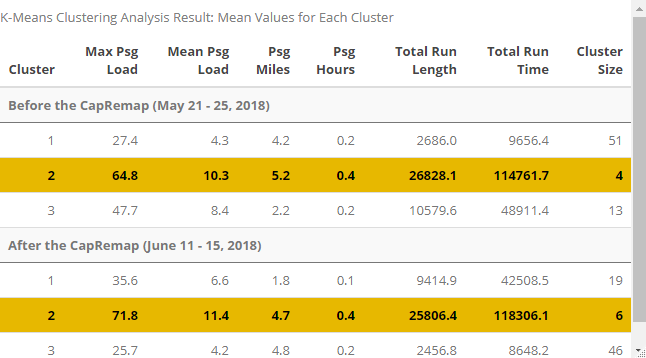

<style>
.superbigimage{
overflow-x:scroll;
white-space: nowrap;
}
.superbigimage img{
max-width: none;
}
</style>

```{r setup, include=FALSE}
knitr::opts_chunk$set(
	echo = TRUE,
	fig.align = "center",
	eval = FALSE, 
	message = FALSE,
	warning = FALSE,
	cache = FALSE,
	results = FALSE
)
options(scipen=99)
```

# 1. Introduction

## 1.1 Background

In 2018, Capital Metropoitan Transportation Authority (CapMetro), a public transportation agency serving Austin, Travis and parts of Williamson Counties, launched the “Cap Remap”, a bus system redesign project, as part of its transit development plan, Connections 2025. Cap Remap adjusted the transit network according to internal analysis and community outreach and aims to provide a more frequent, more reliable, and better connected bus system. Specifically, it remapped certain routes, tripled the number of bus routes that operate every 15 minutes, and made sure the frequency meets the need on weekends. This project brings an opportunity to understand what factors influence bus ridership.

## 1.2 Use Case

Given the renewed interest in bus transit in US cities, such as Austin, there is an opportunity to streamline the bus planning process using modern data science methods. Currently, cities have to gather all the information, such as land use, built environment, demographics etc., from different sources, to gain understanding of bus ridership change in the future. This method is usually time consuming and requires a lot of human resources. Oftentimes, cities have to outsource those analysis to third parties, which inevitably leads to higher project cost. The goal of this article, therefore, is to present a scenario planning tool for planners to test how changes in local land uses and characteristics of bus routes predict bus ridership. If such a predictive model proves robust, planners can use it to evaluate a series of possible pictures regarding the development of different land use and change of bus routes in the future and make strategic decisions efficiently in Austin.
This report is broken into four sections. Section 1 presents an exploratory analysis of the Cap Remap to further understand the trends, patterns, and characteristics of the ridership in Austin, which helps to determine the important features to be incorporated in the predictive model. Section 2 explains the process of model building and model evaluation. Section 3 demonstrates the user interface of the bus network planning application, which is supported by the model developed in Section 2. The last section will be an appendix showing the codes and additional information about the model and application development. 

# 2. Exploratory Analysis
Before diving into the model building,  it is crucial to have a good grasp on the characteristics and anatomy of the bus ridership in Austin in order to construct a useful ridership prediction application for planners to utilize. This section aims to investigate Austin’s ridership data provided by APC and answer the following questions:
How did ridership change before and after the implementation of CapRemap (06/03/2018)?
How does the ridership change across the city?
What types of route characteristics have influences on ridership?
What are the popular bus routes in Austin and what are their attributes?

## 2.1 What Data Are We Using?

The ridership data we used come from the Automated Passenger Counter(APC), which counts the number of boarding and alighting on any given bus. The image below illustrate the APC system at work.

[source](https://www.tsomobile.com/tso-public-transportation/shuttle-bus-resources/)

There are two sets of ridership data that we have used - aggregated and disaggregated. 
Aggregated data presents average ridership data of every single bus stop in the system on weekdays in all the months from 2017 to 2019. We used the aggregated data to explore the annual ridership trend of the bus system and the neighborhood and school district effect on ridership. And these fixed effects are used later in the model. 


Disaggregated data contains more detailed ridership data. It is detailed to each trip within a time period of a week. Therefore, besides the ridership information at a specific bus stop during a specific trip, disaggregated data also provides the trip's route numbers and route directions so that we can associate those route characteristics with the ridership. 
The data used here are disaggregated data in May 21-25th and June 11-15th in 2018, which are one week before and after the CapRemap. As mentioned above, the disaggregated data consist of passenger and bus information for each route, each shift, and each stop. Basically, the number of passenger boarding, alighting, and other related ridership information are recorded at each stop for each shift of each bus route.
We use the disaggregated data to study the relationship between route characteristics, such as route type, route orientations, and riderships, and further identify popular routes and unpopular routes and create additional route-related features for modelling. 


## 2.2 Annual Citywide Ridership Trend

How did ridership change before and after CapRemap (06/03, 2018)?

Current available data from Capital Metro allows us to observe the trend in ridership change before and after Cap Remap. The first important part of exploratory analysis is to see the city-wide change in ridership brought by CapRemap. With the stop-level data from Janurary 207 to November 2019, the aggregated city-wide ridership change is shown in the chart below.

The x-axis represents month, and y-axis repredents the average daily ridership in the given month. The yellow, blue, red lines represents the monthly ridership in year 2017, 2018, 2019, respectively. The vertical line represents month June, which is the month when Cap Remap rolled out in 2018. 

From the trend in 2018, it is clear that ridership fluctuated between months. Year 2017 and 2018 disply similar trend where we see a spike of ridership in June. However, year 2019 seems to have a smoother curve and ridership actually decreased in the same month. We suspect that there might be issues related with data retrieval and will ask for new data. Ridership are generally high in fall and winter in all three years. Our hypothesis is that this could be related with school or university holiday and class schedules. If we ignore the June data and compare the trend across three years, we do see an increasing ridership trend in general, each year has higher ridership than before, which demonstrates the effect of Cap Remap. 


## 2.3 Ridership Pattern in Subdivisions

After knowing the trend of city-wide ridership change, the next question is how the ridership changed across the city: which area experienced ridership increase and which area exprienced ridership decrease. Neighborhoods in Austin are used here to show the spatial trend here. 

As shown in the map, darker blue represents higher ridership increase, darker red presents lower ridership increase or even ridership decrease. As shown in the map, mostly downtown areas experienced ridership increase from June to September while the outskirts of Austin experienced low ridership increase or even ridership decrease.


We then created charts showing the ridership change in each neighborhood in 2018 in June and September. There are 12 neighborhoods experienced ridership decrease from June to September. There are several neighborhoods experienced high ridership increase of more than 10,000 from June to September. Generally, most neighborhoods experienced ridership increase after CapRemap from June to September. Among the 78 neighborhoods in Austin, we identified three neighborhoods that represents different characteristics: neighborhoods with expected ridership increase; neighborhoods with unexpected ridership increase; neighborhoods with unexpected ridership decrease.

UT is the neighborhood with expected ridership increase.The location of UT neighborhood is just above downtown neighborhood. With a lot of university students living around here, the bus network is sensitive to school schedule. There is a relatively clear trend in ridership change according to school seasons.


The second neighborhood Govalle is the neighborhood that experiencnig unexpected ridership increase. After CapRemap, the ridership in Govalle nearly increased by 50% to 75%. As Govalle is closer to the outskirts of Austin, this ridership increase might reflects CapRemap'success in strengthening the east-west connection.


But there are also neighborhoods exepriencing ridership decrease on the east-west direction. Zilker located in the southwest side of Austin's downtown region. Its ridership experienced a gradually slight decrease after CapRemap.


## 2.4 Route Analysis

### 2.4.1 Route Type

What could potentially influence ridership in terms of route information?

There are several route types, each serving different purposes. Our hypothesis is that they will play an important role in determing the ridership.

The Austin Bus System is comprised of nine types of routes. The graphs below show six main route types. Since Capital Metro is a regional transit agency so that its service area covers more than City of Austin. Since we mainly focus our analysis and model building in Austin, the basemap below outlines only City of Ausitn. 

Regarding route types, the characteristics are listed below:

Local: Capital Metro's Local routes are intended to connect specific neighborhoods of Austin to Downtown Austin, with frequent stops.

MetroRapid: Capital Metro's MetroRapid routes is an ostensibly bus rapid transit service serving high-traffic corridors. The service utilizes high-frequency service of every 15 minutes on weekdays with 10 minute service at rush hours. 

UT Shuttle: The UT Shuttle system includes a number of routes during the University of Texas semester. They do not operate on Saturdays, except during finals.

Crosstown: Capital Metro's Crosstown routes are local services between two neighborhoods of Austin, for which the route does not pass through Downtown Austin or the University of Texas.

Limited & Flyer: Capital Metro's Limited and Flyer routes are limited stop services between two destinations. Limited routes tend to have fewer stops compared to their local counterparts, while Flyer routes serve nonstop between downtown or the UT campus and their neighborhoods of service.

Feeder: Capital Metro's Feeder routes are local services between a neighborhood and a major transfer point for connecting service.


### 2.4.2 Hotlines

What makes a good bus system? What's so special about the 'hotlines'?

The following analysis aim to find out what routes are popular, why are they popular, and how they have changed in a micro perspective. Kmeans Cluster Analysis was used to separate the disaggregated data into groups. Kmeans is an unsupervised learning algorithm that automatically group the dataset based on the distribution of each feature. We intend to use this algorithm to see if the resulting grouping identifies the hotlines, i.e. the routes that have higher ridership.

We looked at the Kmeans analysis both before and after the Cap Remap. We get 4 lines labeled as hotlines before the remap, 6 lines labeled as hotlines after the remap. The hotlines before and after the remap are plotted below. Most of the hot routes are north-south direction. There are two new hotlines emerged after the CapRemap, line 10 and line 20, and they are colored in red.


To dive deeper into the characteristics of the hot bus lines, we map out the passenger load for each route at each stop for each direction. We also ploted the passenger load versus stop sequence ID as well as average boarding and alighting at each stop along each route. The purpose of this analysis is to first, find out what is so special about the hotlines, and second, see trends before and after the Cap Remap. Note that the Austin bus system has different patterns for each route, and in order to make sure the plots to make sense, we only selected the most used pattern for each plot. Below we chose two Line 20 (type High Frequency) and Line 801(Metro Rapid) to demonstrate detailed route analysis.


Below is the analysis for Line 801.


By mapping and plotting the average passenger number on bus as well as the average boarding and alighting at each stop, we can see better how specific location or neighborhood could potentially contribute to the ridership. These regions will be feature engineered in the following analysis. We also noticed that ridership tends to be higher in the middle portion of the trip, this means a lot of the passengers board from early stops to stops near the ends.

In conclusion, hotlines have the following characteristics:

- In terms of bus route types, Local, MetroRapid, and High Frequency routes have high ridership
- In terms of geographical distribution:
* Go through Hubs (UT, DT, Pleasant Valley)
* Mostly North-South direction (Following the shape / geography of the city)
* Going across the a large portion of the city
- In terms of temporal trend, we know that more Shifts were added in the day time and rush hours, which might increase ridership.

# 3. Modeling

## 3.1 Strategies

We will be creating a machine learning model that predicts the ridership at each stop. Specifically, we will look at how Linear, Lasso and Ridge regression, Random Forest, and Xgboost captures the variability in our dataset. We will start with feature engineering, which consists of 5 major categories: amenity, built environment, demographics, route network, stop characteristics (internal data). The hypothesis is that these five categories will influence the ridership at each stop in different ways. The dependent variable we used is the average ridership for each stop in 2019. We use 2019 data because we want to focus on the data after Cap Remap, and our feature engineering aligns with the year 2019 better. 

## 3.2 Feature Engineering

The feature table below demonstrates five types of features and the sources of each feature. All data comes from the following sources: APC aggregated and disaggregated data, Capital Metro, OpenStreetMap (OSM), Open Data Austin, and ACS Census.

For amenity, a buffer of 1/4 miles around each station is created. The number of each type of amenity within the buffer is calculated. In order to capture the distance factor related between stops and amenities, the distance between the stop and the closest 3 amenities are calculated as well. 

For the built environment, some features are spatially joined with the stops, such as the neighborhood and the school district data. The area percentage of each type of land use within the buffer is calculated as well. The building density is approximated as a function of building lot area times the building height. 

For demographics, we used Areal Weighted Interpolation and joined the weighted census estimates within the buffer to each stop.

For route information, the percentage of each route type passing each bus stop is calculated. The number of shifts going through each stop on a given week is also calculated.

For the internal (stop characteristics) category, we first added a transit hub dummy defined by Capital Metro; we then calculated the spatial lag, which is the average ridership of the surrounding stops.


A series of analysis is conducted to see what features are important. We first looked at the correlation between all features and the dependent variable, the mean ridership in 2019. Below are selected features that highly correlate with ridership positively and negatively. We found that the route information, amenity distance, and stop characteristics often correlates highly with ridership.


A correlation matrix is made to see potential collinearity between all features as well as the dependent variable. We found that certain features correlate highly, such as route direction feature SouthNorth versus WestEast, land use feature commercial versus residential, amenity feature distance to CBD versus distance to train stations. It is important to identify these variables when using features in the model.


## 3.3 Results and Validation

With the features created in five categories, there are four types of models built: simple linear regression model (lm in the following visualizations), lasso and ridge regression model (glmnet in the following visualizations); random forest model (rf in the following visualizations) and xgboost model (xgb in the following visualizations).
As mentioned in the exploratory analysis, neighborhood has been contributing a huge impact on ridership as downtown and UT influence the ridership pattern a lot by its natural built environments or school schedules. Likewise, school districts is another critical impact on ridership. Thus in the modeling validation section, neighborhood and school district are used to test the model's generalizability.

### 3.3.1 Neighborhood Fixed Effect

The MAPE and MAE of the four models reveals that, genrally speaking, random forest model is the model with the best accuracy while lasso and ridge model gives prediction less accurately than other three. Lasso and ridge regression has the largest MAPE and MAE while random forest model has the least MAPE and MAE.

{width=400px}{width=400px}

In terms of predicted value and actual values, simple linear regression tends to underpredict ridership when the actual ridership is higher than 300.Lasso and ridge model generally overpredict ridership. Random forest model tends to overpredict ridership when the actual ridership is over 250. Xgboost model generally overpredict ridership but performs better than glmnet model when the actual ridership is low.

{width=350px}

In order to test the the generaliability of the models on neighborhoods, the following bar chart reveals each model's MAE in the neighborhoods. The charts demonstrate most of the MAEs are below 100. There are several neighborhoods appear to have a higher MAE among which most of them gathered around UT.

{width=1200px}

To take a closer look at the neighborhoods, maps of MAPE are plotted to show the generalizability. As mentioned before, the model's acuuracy is lower in the neighborhoods around University of Texas. 

{width=400px}{width=400px}
{width=400px}{width=400px}


# 4. Next Steps
With all of the findings from the modeling results and validation, there are several steps that we are considering to take, in order to improve the model's generalizability around UT area.
- Using ensemble
- Tune hyperparameters
- Further feature engineering
- Use different buffer radius

# 5. Appendix

## Setup

```{r}
######### Package installs #########
load.fun <- function(x) { 
  x <- as.character(x) 
  if(isTRUE(x %in% .packages(all.available=TRUE))) { 
    eval(parse(text=paste("require(", x, ")", sep=""))) 
    print(paste(c(x, " : already installed; requiring"), collapse=''))
  } else { 
    #update.packages()
    print(paste(c(x, " : not installed; installing"), collapse=''))
    eval(parse(text=paste("install.packages('", x, "')", sep=""))) 
    print(paste(c(x, " : installed and requiring"), collapse=''))
    eval(parse(text=paste("require(", x, ")", sep=""))) 
  } 
} 

######### Required Packages ######### 
packages = c("areal", "bayesplot", "broom",  "caret", "class", "ckanr", "corrplot", "data.table", "dials", "doParallel", "dplyr", "e1071", "earth", "FNN", "flexclust", "geojsonsf", "gganimate", "ggrepel", "glmnet", "ggmap","ggplot2","grid","gridExtra", "ipred", "kableExtra", "kknn", "klaR", "knitr", "leaflet", "lme4", "lubridate", "magrittr", "MASS", "mapview", "metR", "mltools", "NbClust", "nnet", "nngeo", "openxlsx", "osmdata", "plotly", "pROC", "QuantPsyc", "randomForest", "ranger", "RColorBrewer", "RcppEigen", "recipes", "reshape2", "rpart", "RSocrata", "rstan", "sessioninfo", "sf", "shinystan", "spatstat", "spdep", "stargazer", "themis", "tidycensus", "tidymodels", "tidyr", "tidyverse", "tigris", "viridis", "workflows", "xgboost")

for(i in seq_along(packages)){
  packge <- as.character(packages[i])
  load.fun(packge)
}

session_info()
```

```{r}
######### Set Up Functions and Plotting Options ######### 
mapTheme <- function(base_size = 12) {
  theme(
    text = element_text( color = "black"),
    plot.title = element_text(size = 14,colour = "black"),
    plot.subtitle=element_text(face="italic"),
    plot.caption=element_text(hjust=0),
    axis.ticks = element_blank(),
    panel.background = element_blank(),axis.title = element_blank(),
    axis.text = element_blank(),
    axis.title.x = element_blank(),
    axis.title.y = element_blank(),
    panel.grid.minor = element_blank(),
    panel.border = element_rect(colour = "black", fill=NA, size=2)
  )
}

qBr <- function(df, variable, rnd) {
  if (missing(rnd)) {
    as.character(quantile(round(df[[variable]],0),
                          c(.01,.2,.4,.6,.8), na.rm=T))
  } else if (rnd == FALSE | rnd == F) {
    as.character(formatC(quantile(df[[variable]]), digits = 3),
                 c(.01,.2,.4,.6,.8), na.rm=T)
  }
}

q5 <- function(variable) {as.factor(ntile(variable, 5))}

plotTheme <- theme(
  plot.title =element_text(size=12),
  plot.subtitle = element_text(size=8),
  plot.caption = element_text(size = 6),
  axis.text.x = element_text(size = 10, angle = 45, hjust = 1),
  axis.text.y = element_text(size = 10),
  axis.title.y = element_text(size = 10),
  panel.background=element_blank(),
  plot.background=element_blank(),
  axis.ticks=element_blank())

plotTheme <- function(base_size = 12) {
  theme(
    text = element_text( color = "black"),
    plot.title = element_text(size = 14,colour = "black"),
    plot.subtitle = element_text(face="italic"),
    plot.caption = element_text(hjust=0),
    axis.ticks = element_blank(),
    panel.background = element_blank(),
    panel.grid.major = element_line("grey80", size = 0.1),
    panel.grid.minor = element_blank(),
    panel.border = element_rect(colour = "black", fill=NA, size=1.5),
    strip.background = element_rect(fill = "grey80", color = "white"),
    strip.text = element_text(size=12),
    axis.title = element_text(size=12),
    axis.text = element_text(size=10),
    plot.background = element_blank(),
    legend.background = element_blank(),
    legend.title = element_text(colour = "black", face = "italic"),
    legend.text = element_text(colour = "black", face = "italic"),
    strip.text.x = element_text(size = 14)
  )
}
```

## Load Data
```{r load data}
######### Load Data ######### 
setwd('C:/Users/HanyongXu/Documents/Me/grad/Spring_2020/MUSA801')

data = read.csv('Data/MUSA Data - Stop Ridership Aggregated.csv')
agg <- data######### need to add new agg data path
disagg = read.csv('Data/MUSA Disagregated Data Sample 01-06-2020 to 01-10-2020.csv')
disagn1 = read.delim('Data/May 2018 Detail 21 to 25.txt', header = FALSE, sep = "\t", dec = ".")
colnames(disagn1) <- colnames(disagg)
disagn2 = read.delim('Data/June 2018 Detail 11 to 15.txt', header = FALSE, sep = "\t", dec = ".")
colnames(disagn2) <- colnames(disagg)

nhood = st_read('https://data.austintexas.gov/resource/nz5f-3t2e.geojson')%>%
  st_set_crs(4326)%>%
  st_transform(2278)
austin <- st_read('https://data.austintexas.gov/api/geospatial/3pzb-6mbr?method=export&format=GeoJSON')%>% st_transform(2278)
serviceArea <- st_read('Data/Shapefiles_-_JUNE_2018/Service_Area.shp') %>% st_transform(2278)
NewRoutes <- st_read('Data/Jia/NewRoutes.shp')
HighFreq <- st_read('Data/Jia/HighFrequency.shp')
Replaced <- st_read('Data/Jia/EliminatedReplacement.shp')
Eliminated <- st_read('Data/Jia/Eliminated.shp')
stops <- st_read("Data/Shapefiles_-_JUNE_2018/Stops.shp")%>%
  st_transform(2278)

Routes1801 <- st_read("Data/Shapefiles_-_JANUARY_2018/Routes.shp")
Routes2001 <- st_read('Data/Jia/Routes2001.shp')
```

## Background

```{r processing}
Routes1801 <- Routes1801%>%
  mutate(capremap = "Before Cap Remap")

Routes2001 <- Routes2001%>%
  mutate(capremap = "After Cap Remap")
```

### Data Structure

```{r}
#turn dataframe into spacitial object
agg_sf <- agg%>%
  st_as_sf(coords = c("LONGITUDE", "LATITUDE"), crs = 4326)%>%
  st_transform(2278)

disagg_sf <- disagg%>%
  st_as_sf(coords = c("LONGITUDE", "LATITUDE"), crs = 4326)%>%
  st_transform(2278)

# We use aggregated data to look at the average ridership on weekdays at individual stops
ggplot()+
  geom_sf(data = subset(serviceArea,NAME == "Austin"), aes(fill = "Austin"))+
  scale_fill_manual(values = c("Service Areas" = "gray25", "Austin" = "black"), name = NULL,
                    guide = guide_legend("Jurisdictions", override.aes = list(linetype = "blank", shape = NA)))+
  geom_sf(data = subset(agg_after_sf, STOP_ID == 476), aes(color = "Stop 476"), size = 2, show.legend = "point")+
  scale_colour_manual(values = c("Stop 476" = "darkorange"),
                      guide = guide_legend("Aggregated Data Example"))+
  labs(title = "Aggregated Data Structure",
       subtitle = "Data from Capital Metro")+
  ggrepel::geom_label_repel(
    data = subset(agg_after_sf, STOP_ID == 476),aes(label = "Average Ridership = 33 \n Average Passing Buses = 55", geometry = geometry),
    stat = "sf_coordinates",
    min.segment.length = 3)+mapTheme()

# We use disaggregated data to investigate the average ridership on weekdays on different routes.
disagg_803 <- subset(disagg_sf, ROUTE == 803)%>%
  group_by(STOP_ID)%>%
  summarize(avg_on = mean(PSGR_ON),
            avg_load = mean(PSGR_LOAD))
ggplot()+
  geom_sf(data = subset(serviceArea,NAME == "Austin"), aes(fill = "Austin"))+
  scale_fill_manual(values = c("Service Areas" = "gray25", "Austin" = "black"), name = NULL,
                    guide = guide_legend("Jurisdictions", override.aes = list(linetype = "blank", shape = NA)))+
  geom_sf(data = disagg_803, aes(color = "Stops on Route 803"), size = 2, show.legend = "point")+
  scale_colour_manual(values = c("Stops on Route 803" = "darkorange"),
                      guide = guide_legend("Disggregated Data Example"))+
  labs(title = "Disaggregated Data Structure",
       subtitle = "Data from Capital Metro")+
  geom_label_repel(
    data = subset(disagg_803, STOP_ID == 2606),aes(label = "Average On-board Passengers of Stop 2606 = 11 \n Route Type = Metro Rapid", geometry = geometry),
    stat = "sf_coordinates",
    min.segment.length = 0,
    segment.color = "lightgrey",
    point.padding = 20)+mapTheme()
```

### Route Types Changes

```{r overview map}
ggplot()+
  geom_sf(data = serviceArea, aes(fill = "Service Areas"))+
  geom_sf(data = subset(serviceArea, NAME == "Austin"), aes(fill = "Austin"))+
  scale_fill_manual(values = c("Service Areas" = "gray25", "Austin" = "black"), name = NULL,
                    guide = guide_legend("Jurisdictions", override.aes = list(linetype = "blank", shape = NA))) +
  geom_sf(data = Eliminated, aes(color = "Eliminated Routes"), lwd = 0.5, show.legend = "line")+
  geom_sf(data = Replaced, aes(color = "Eliminated but Replaced Routes"),lwd = 0.5, show.legend = "line")+
  geom_sf(data = HighFreq, aes(color = "High Frequency Routes"), lwd = 0.8, show.legend = "line")+
  geom_sf(data = NewRoutes, aes(color = "New Routes"),lwd = 0.8, show.legend = "line")+
  scale_colour_manual(values = c("Eliminated Routes" = "darkorange", "Eliminated but Replaced Routes" = "gold", "High Frequency Routes" = "dodgerblue", "New Routes" = "deeppink"),
                      guide = guide_legend("Routes", override.aes = list(linetype = c("solid", "solid", "solid", "solid"), shape = c(NA, NA, NA, NA))))+
  labs(title = "Cap Remap Route Changes",
       subtitle = "City of Austin, June 2018")+mapTheme()
```

```{r major change route types}
# Local
local <- ggplot()+
  geom_sf(data = subset(serviceArea, NAME == "Austin"), aes(fill = "Austin"))+
  scale_fill_manual(values = c("Service Areas" = "gray25", "Austin" = "black"), name = NULL,
                    guide = guide_legend("Jurisdictions", override.aes = list(linetype = "blank", shape = NA))) +
  geom_sf(data = subset(Routes1801, ROUTETYPE == "Local"), color = "lightblue2",lwd = 0.8,show.legend = FALSE)+
  geom_sf(data = subset(Routes2001, ROUTETYPE == "Local"), color = "lightblue2",lwd = 0.8,show.legend = FALSE)+
  facet_grid(~capremap)+
  labs(title = "Local Routes Before and After Cap Remap")+mapTheme()

# HighFrequency
highFrequency <- ggplot()+
  geom_sf(data = subset(serviceArea, NAME == "Austin"), aes(fill = "Austin"))+
  scale_fill_manual(values = c("Service Areas" = "gray25", "Austin" = "black"), name = NULL,
                    guide = guide_legend("Jurisdictions", override.aes = list(linetype = "blank", shape = NA))) +
  geom_sf(data = subset(Routes1801, ROUTETYPE == "High Frequency"), color = "dodgerblue",lwd = 0.8,show.legend = FALSE)+
  geom_sf(data = subset(Routes2001, ROUTETYPE == "High Frequency"), color = "dodgerblue",lwd = 0.8,show.legend = FALSE)+
  facet_grid(~capremap)+
  labs(title = "High Frequency Routes Before and After Cap Remap")+mapTheme()

# major changes grid arrange
grid.arrange(local, highFrequency, ncol = 1)
```

```{r minor change route types, fig.width = 25, fig.height= 10}
# Crosstown
crosstown <-ggplot()+
  geom_sf(data = subset(serviceArea, NAME == "Austin"), aes(fill = "Austin"))+
  scale_fill_manual(values = c("Service Areas" = "gray25", "Austin" = "black"), name = NULL,
                    guide = guide_legend("Jurisdictions", override.aes = list(linetype = "blank", shape = NA))) +
  geom_sf(data = subset(Routes1801, ROUTETYPE == "Crosstown"), color = "greenyellow",lwd = 0.8,show.legend = FALSE)+
  geom_sf(data = subset(Routes2001, ROUTETYPE == "Crosstown"), color = "greenyellow",lwd = 0.8,show.legend = FALSE)+
  facet_grid(~capremap)+
  labs(title = "Crosstown Routes Before and After Cap Remap")+mapTheme()

# Feeder
feeder <-ggplot()+
  geom_sf(data = subset(serviceArea, NAME == "Austin"), aes(fill = "Austin"))+
  scale_fill_manual(values = c("Service Areas" = "gray25", "Austin" = "black"), name = NULL,
                    guide = guide_legend("Jurisdictions", override.aes = list(linetype = "blank", shape = NA))) +
  geom_sf(data = subset(Routes1801, ROUTETYPE == "Feeder"), color = "lightcoral",lwd = 0.8, show.legend = FALSE)+
  geom_sf(data = subset(Routes2001, ROUTETYPE == "Feeder"), color = "lightcoral",lwd = 0.8, show.legend = FALSE)+
  facet_grid(~capremap)+
  labs(title = "Feeder Routes Before and After Cap Remap")+mapTheme()


# Flyer
flyer <- ggplot()+
  geom_sf(data = subset(serviceArea, NAME == "Austin"), aes(fill = "Austin"))+
  scale_fill_manual(values = c("Service Areas" = "gray25", "Austin" = "black"), name = NULL,
                    guide = guide_legend("Jurisdictions", override.aes = list(linetype = "blank", shape = NA))) +
  geom_sf(data = subset(Routes1801, ROUTETYPE == "Flyer"), color = "magenta2",lwd = 0.8,show.legend = FALSE)+
  geom_sf(data = subset(Routes2001, ROUTETYPE == "Flyer"), color = "magenta2",lwd = 0.8,show.legend = FALSE)+
  facet_grid(~capremap)+
  labs(title = "Flyer Routes Before and After Cap Remap")+mapTheme()

# Express
express <-ggplot()+
  geom_sf(data = subset(serviceArea, NAME == "Austin"), aes(fill = "Austin"))+
  scale_fill_manual(values = c("Service Areas" = "gray25", "Austin" = "black"), name = NULL,
                    guide = guide_legend("Jurisdictions", override.aes = list(linetype = "blank", shape = NA))) +
  geom_sf(data = subset(Routes1801, ROUTETYPE == "Express"), color = "red",lwd = 0.8,show.legend = FALSE)+
  geom_sf(data = subset(Routes2001, ROUTETYPE == "Express"), color = "red",lwd = 0.8,show.legend = FALSE)+
  facet_grid(~capremap)+
  labs(title = "Express Routes Before and After Cap Remap")+mapTheme()

# Special
special <- ggplot()+
  geom_sf(data = subset(serviceArea, NAME == "Austin"), aes(fill = "Austin"))+
  scale_fill_manual(values = c("Service Areas" = "gray25", "Austin" = "black"), name = NULL,
                    guide = guide_legend("Jurisdictions", override.aes = list(linetype = "blank", shape = NA))) +
  geom_sf(data = subset(Routes1801, ROUTETYPE == "Special"), color = "seashell2",lwd = 0.8,show.legend = FALSE)+
  geom_sf(data = subset(Routes2001, ROUTETYPE == "Special"), color = "seashell2",lwd = 0.8,show.legend = FALSE)+
  facet_grid(~capremap)+
  labs(title = "Speical Routes Before and After Cap Remap")+mapTheme()

# minor changes grid arrange

grid.arrange(crosstown, feeder, flyer, express, ncol =2)
```

``` {r no change route types, fig.width = 25, fig.height= 10}
# UT Shuttle
UTShuttle <- ggplot()+
  geom_sf(data = subset(serviceArea, NAME == "Austin"), aes(fill = "Austin"))+
  scale_fill_manual(values = c("Service Areas" = "gray25", "Austin" = "black"), name = NULL,
                    guide = guide_legend("Jurisdictions", override.aes = list(linetype = "blank", shape = NA))) +
  geom_sf(data = subset(Routes1801, ROUTETYPE == "UT Shuttle"), color = "orange",lwd = 0.8,show.legend = FALSE)+
  geom_sf(data = subset(Routes2001, ROUTETYPE == "UT Shuttle"), color = "orange",lwd = 0.8,show.legend = FALSE)+
  facet_grid(~capremap)+
  labs(title = "UT Shuttle Before and After Cap Remap")+mapTheme()

# Nigh Owl
nightowl <- ggplot()+
  geom_sf(data = subset(serviceArea, NAME == "Austin"), aes(fill = "Austin"))+
  scale_fill_manual(values = c("Service Areas" = "gray25", "Austin" = "black"), name = NULL,
                    guide = guide_legend("Jurisdictions", override.aes = list(linetype = "blank", shape = NA))) +
  geom_sf(data = subset(Routes1801, ROUTETYPE == "Night Owl"), color = "slategray2",lwd = 0.8,show.legend = FALSE)+
  geom_sf(data = subset(Routes2001, ROUTETYPE == "Night Owl"), color = "slategray2",lwd = 0.8,show.legend = FALSE)+
  facet_grid(~capremap)+
  labs(title = "Nigh Owl Routes Before and After Cap Remap")+mapTheme()

# no change grid arrange
grid.arrange(UTShuttle, special, nightowl, ncol = 2)
```

## Exploratory Analysis

### Ridership Typology

```{r}
#create stop shapefile
agg_sf <- agg%>%
  st_as_sf(coords = c("LONGITUDE", "LATITUDE"), crs = 4326)%>%
  st_transform(2278)

agg_sf19 <- agg_sf%>%
  filter(YEAR_ID == 2019)%>%
  group_by(STOP_ID)%>%
  summarize(avg_on = mean(AVERAGE_ON))

#Read UT and CBD shapefiles
UT <- st_read("D:/Spring20/Practicum/data/UTAustin/UT.shp")%>%
  st_transform(2278)
CBD <- st_read("D:/Spring20/Practicum/data/CBD/CBD.shp")%>%
  st_transform(2278)

#create shapefile of area outside of CBD
nhood_CBD <- st_difference(nhood_merge, CBD)

#ST_DIFFERENCE didnt work for UT; created in Arcmap
nhood_UT <- st_read("D:/Spring20/Practicum/data/nhood_UT.shp")%>%
  st_as_sf()%>%
  st_transform(2278)

#Create CBD typology
agg_sf19_CBD <- st_join(CBD, agg_sf19, join = st_contains)%>%
  mutate(typology = "CBD")

agg_sf19_oCBD <- st_join(nhood_CBD, agg_sf19, join = st_contains)%>%
  mutate(typology = "oCBD")%>%
  rename(geometry = x)

agg_sf19_oCBD <- agg_sf19_oCBD%>%
  group_by(Id)%>%
  summarize(avg_on = mean(avg_on))%>%
  mutate(label = "The Rest of Austin")

agg_CBD_typology <- rbind(agg_sf19_CBD,agg_sf19_oCBD)

#Create UT typology
agg_sf19_UT <- st_join(UT, agg_sf19, join = st_contains)%>%
  mutate(typology = "UT")

agg_sf19_UT <- agg_sf19_UT%>%
  group_by(Id)%>%
  summarize(avg_on = mean(na.omit(avg_on)))%>%
  mutate(label = "UT Austin")

agg_sf19_oUT <- st_join(nhood_UT, agg_sf19, join = st_contains)%>%
  mutate(typology = "oUT")%>%
  select(STOP_ID,
         avg_on,
         typology,
         geometry)

agg_sf19_oUT <- agg_sf19_oUT%>%
  group_by(Id)%>%
  summarize(avg_on = mean(na.omit(avg_on)))%>%
  mutate(label = "The Rest of Austin")

agg_UT_typology <- rbind(agg_sf19_UT,agg_sf19_oUT)

```


### How did ridership change before and after CapRemap (06/03, 2018)?

```{r}
#Transform the three year's data into the same format
New <- read.csv("C:/Upenn/Practicum/Data/Stop Data _2017_2019.csv")
#Only keep the data for weekdays by selecting service day
data_new <- New %>%
  subset(New$SERVICE_DAY == 1)

data_2017 <- read.csv("C:/Upenn/Practicum/Data/Stop Data January - June 2017 .csv")
data_new_2017 <-data_2017%>%
  subset(data_2017$SERVICE_DAY == 1)
#Get three year's data combines
data_all <- rbind(data_new, data_new_2017)
#In order to change the months into (-6,6), each year's data needs to be extracted
data.2017 <- data_all %>%
  subset(data_all$YEAR_ID == 2017)
data.2018 <- data_all %>%
  subset(data_all$YEAR_ID == 2018)
data.2019 <- data_all %>%
  subset(data_all$YEAR_ID == 2019)
#Create the month column and before column for future visualization
data.2018$MONTH_ID <- as.numeric(data.2018$MONTH_ID)
data.2018$Month <- data.2018$MONTH_ID - 6
data.2018$Before <- ifelse(data.2018$Month < 0, 1, 0)

data.2019$MONTH_ID <- as.numeric(data.2019$MONTH_ID)
data.2019$Month <- data.2019$MONTH_ID - 6
data.2019$Before <- ifelse(data.2019$Month < 0, 1, 0)

data.test <- rbind(data.2018, data.2019)
data.test$YEAR_ID <- as.factor(data.test$YEAR_ID)
data.test$AVERAGE_ON <- as.numeric(data.test$AVERAGE_ON)

###Add 2017 data
data.2017$MONTH_ID <- as.numeric(data.2017$MONTH_ID)
data.2017$Month <- data.2017$MONTH_ID - 6
data.2017$Before <- ifelse(data.2017$Month < 0, 1, 0)

data_final <- rbind(data.2017,data.test)
data_final$AVERAGE_ON <- as.numeric(data_final$AVERAGE_ON)


plot.all
```


```{r}
#Create the annual ridership plot
plot.all<-
  as.data.frame(data_final) %>%
  group_by(Month, YEAR_ID) %>% 
  summarize(BOARD_Count = sum(AVERAGE_ON), Time = as.factor(max(Before))) %>%
  ggplot(aes(x=Month,y=BOARD_Count,  colour = Time, linetype = YEAR_ID)) + 
  geom_point() + stat_smooth(size=1) +
  plotTheme() +
  ylim(70000,170000) +
  labs(title="System-wide Ridership on an average weekday among all the stops in Austin",
       subtitle="CapRemap Redesign Implemented Month in Blue", x="Month", y="Average Daily Ridership")+ 
  geom_vline(xintercept = 0, color = "blue")+
  scale_colour_manual(values = c("#E7B800", "#0072B2"), name="Time Period (Before,After)", breaks=c("0", "1"), labels=c("After", "Before"))+
  # scale_color_brewer(palette = "YlGnBu")
  scale_linetype_manual(values=c("dotted", "solid", "dashed"))

```


### Ridership Change in Different Neighborhoods in Austin in 2018

```{r}
#Transform ridership data into geo data
data.2018.sf <-
  data.2018 %>%
  st_as_sf(coords = c("LONGITUDE", "LATITUDE"), crs = 4326, agr = "constant") %>%
  st_transform(2278)

data.y.sf <-
  data.y %>%
  st_as_sf(coords = c("LONGITUDE", "LATITUDE"), crs = 4326, agr = "constant") %>%
  st_transform(2278)
```

```{r}
#Load the transformed dataset from long format-stop level to long format-neighborhood level
Rider_nhood4 <- read.csv("Data/GRACE/Rider_nhood4.csv")
Rider_nhood4$Before <- ifelse(Rider_nhood4$Month == -5 |Rider_nhood4$Month == -4 |Rider_nhood4$Month == -3|Rider_nhood4$Month == -2|Rider_nhood4$Month == -1, "1", "0")
Rider_nhood <- read.csv("Data/GRACE/Rider_nhood.csv")
Rider <- merge(Rider_nhood4, nhood, by = "label")
```

```{r, eval=F, echo=T}
ggplot() +
    geom_sf(data = Rider, aes(fill = q5(Dif))) +
    scale_fill_brewer(palette = "RdYlBu",
                      aesthetics = "fill",
                      labels=qBr(Rider,"Dif"),
                      name="Quintile\nBreaks") +
    labs(title="Ridership Change in Neighborhoods") +
    mapTheme()
```

```{r,fig.height = 30, fig.width = 15}
plot.nhood <- 
  as.data.frame(Rider_nhood4) %>%
  arrange(desc(Dif))%>%
    ggplot(aes(x=Month,y=BOARD_Count, colour = Before)) + 
      geom_point() + stat_smooth(size=1) +
      plotTheme() +
      facet_wrap(Dif~label,scales="free", ncol=4) +
      labs(title="Average Daily Ridership by Neighborhoods in Austin",
           subtitle="CapRemap Redesign Implemented Month in Blue", x="Month", y="Average Daily Ridership in the Neighborhood")+ 
      geom_vline(xintercept = 0, color = "blue")+
      scale_colour_manual(values = c("#0072B2", "#E7B800"),name="Time Period (Before,After)", breaks=c("0", "1"), labels=c("After", "Before"))

plot.nhood
```

```{r}
UT <- Rider_nhood4 %>%
  subset(Rider_nhood4$label == "UT")

plot.UT <- 
  as.data.frame(UT) %>%
  arrange(desc(Dif))%>%
    ggplot(aes(x=Month,y=BOARD_Count, colour = Before)) + 
      geom_point() + stat_smooth(size=1) +
      plotTheme() +
      facet_wrap(Dif~label,scales="free", ncol=4) +
      labs(title="Average Daily Ridership in UT Neighborhood",
           subtitle="CapRemap Redesign Implemented Month in Blue", x="Month", y="Average Daily Ridership in UT Neighborhood")+ 
      geom_vline(xintercept = 0, color = "blue")+
      scale_colour_manual(values = c("#0072B2", "#E7B800"),name="Time Period (Before,After)", breaks=c("0", "1"), labels=c("After", "Before"))
```

```{r}
UT2 <- nhood%>%
  subset(nhood$label == "UT")
Map.UT<-
  ggplot() +
  geom_sf(data = nhood, fill = "grey30") +
  geom_sf(data = UT2, fill = "#56B4E9") +
  labs(title = "UT Neighborhoods") +
  mapTheme() + theme(legend.position = "bottom")
```

```{r}
print(plot.UT)
#print(Map.UT, vp=viewport(.85,.815,.35,.5))
print(Map.UT, vp=viewport(.85,.72,.4,.42))
```

```{r}
Govalle <- Rider_nhood4 %>%
  subset(Rider_nhood4$label == "Govalle")

plot.Govalle <- 
  as.data.frame(Govalle) %>%
  arrange(desc(Dif))%>%
    ggplot(aes(x=Month,y=BOARD_Count, colour = Before)) + 
      geom_point() + stat_smooth(size=1) +
      plotTheme() +
      facet_wrap(Dif~label,scales="free", ncol=4) +
      labs(title="Average Daily Ridership in Govalle Neighborhood",
           subtitle="CapRemap Redesign Implemented Month in Blue", x="Month", y="Average Daily Ridership in Govalle Neighborhood")+ 
      geom_vline(xintercept = 0, color = "blue")+
      scale_colour_manual(values = c("#0072B2", "#E7B800"),name="Time Period (Before,After)", breaks=c("0", "1"), labels=c("After", "Before"))
```

```{r}
Govalle2 <- nhood%>%
  subset(nhood$label == "Govalle")
Map.Govalle<-
  ggplot() +
  geom_sf(data = nhood, fill = "grey30") +
  geom_sf(data = Govalle2, fill = "#56B4E9") +
#  labs(title = "Govalle Neighborhoods") +
  mapTheme() + theme(legend.position = "bottom")
```

```{r}
print(plot.Govalle)
print(Map.Govalle, vp=viewport(.85,.72,.4,.42))
```

```{r}
Zilker <- Rider_nhood4 %>%
  subset(Rider_nhood4$label == "Zilker")

plot.Zilker <- 
  as.data.frame(Zilker) %>%
  arrange(desc(Dif))%>%
    ggplot(aes(x=Month,y=BOARD_Count, colour = Before)) + 
      geom_point() + stat_smooth(size=1) +
      plotTheme() +
      facet_wrap(Dif~label,scales="free", ncol=4) +
      labs(title="Average Daily Ridership in Zilker Neighborhood",
           subtitle="CapRemap Redesign Implemented Month in Blue", x="Month", y="Average Daily Ridership in Zilker Neighborhood")+ 
      geom_vline(xintercept = 0, color = "blue")+
      scale_colour_manual(values = c("#0072B2", "#E7B800"),name="Time Period (Before,After)", breaks=c("0", "1"), labels=c("After", "Before"))
```

```{r}
Zilker2 <- nhood%>%
  subset(nhood$label == "Zilker")
Map.Zilker<-
  ggplot() +
  geom_sf(data = nhood, fill = "grey30") +
  geom_sf(data = Zilker2, fill = "#56B4E9") +
#  labs(title = "Zilker Neighborhoods") +
  mapTheme() + theme(legend.position = "bottom")
```

```{r}
print(plot.Zilker)
print(Map.Zilker, vp=viewport(.85,.72,.4,.42))
```

```{r}
############ data.2019, new data code
```

### Identify the Hotlines

First, let us look at the Kmeans analysis before the CapRemap. We group the disaggregated data by routes, and calculated the max and mean number of passengers on bus at each stop, the average miles traveled and the average hours spent for each passenger at each stop, as well as the total run length and total run time of the route.

```{r}
disagn1_km = disagn1 %>%
  group_by(ROUTE) %>%
  summarise(max_load = max(PSGR_LOAD), mean_load = mean(PSGR_LOAD), 
            psgmiles = mean(PSGR_MILES), psghours = mean(PSGR_HOURS), 
            rlength = sum(ACT_MILES_SINCE_LAST_STOP), rtime = sum(ACT_MINS_SINCE_LAST_STOP))
```

```{r}
exclude_x <- names(disagn1_km) %in% c("ROUTE")
disagn1_km1 <- disagn1_km[!exclude_x]
```

Then, we apply Kmeans analysis. The number of clusters are determined by both the elbow chart and the 26 criteria provided by the NbClus package. For more information, see appendix.
```{r}
fit.km <- kmeans(disagn1_km1, 3, nstart=25)

summary_before = cbind(round(aggregate(disagn1_km1, by=list(cluster=fit.km$cluster), mean),1),fit.km$size)
disagn1_km$cluster = fit.km$cluster
```

We do the same analysis to the disaggregated dataset after the CapRemap.
```{r}
disagn2_km = disagn2 %>%
  group_by(ROUTE) %>%
  summarise(max_load = max(PSGR_LOAD), mean_load = mean(PSGR_LOAD), 
            psgmiles = mean(PSGR_MILES), psghours = mean(PSGR_HOURS), 
            rlength = sum(ACT_MILES_SINCE_LAST_STOP), rtime = sum(ACT_MINS_SINCE_LAST_STOP))
```

```{r}
exclude_x <- names(disagn2_km) %in% c("ROUTE")
disagn2_km1 <- disagn2_km[!exclude_x]
```

```{r}
fit.km <- kmeans(disagn2_km1, 3, nstart=25)

summary_after = cbind(round(aggregate(disagn2_km1, by=list(cluster=fit.km$cluster), mean),1),fit.km$size)
disagn2_km$cluster = fit.km$cluster
```

These clustering labels are joined to the original dataset. For more about the clustering result, please see appendix.
```{r}
hotlines_pre = unique(disagn1_km[(disagn1_km$cluster == 2),]$ROUTE)
hotlines_po = unique(disagn2_km[(disagn2_km$cluster == 2),]$ROUTE)

print("Hotlines Before:")
print(hotlines_pre)
print("Hotlines After:")
print(hotlines_po)
```

```{r}
disagn1j = left_join(disagn1, disagn1_km)
disagn2j = left_join(disagn2, disagn2_km)
```
Find the number of kmeans clusters for both before and after the CapRemap:

Both the Elbow chart and the 26 indicies provided by the NbClust package are used to check how many clusters should be used in the Kmeans analysis.

Before CapRemap:
```{r}
wss <- (nrow(disagn1_km1)-1)*sum(apply(disagn1_km1,2,var))
for (i in 2:20) wss[i] <- sum(kmeans(disagn1_km1,centers=i)$withinss)
plot(1:20, wss, type="b", xlab="Number of Clusters", ylab="Within groups sum of squares")
```

```{r}
set.seed(1234)
nc <- NbClust(disagn1_km1, min.nc=2, max.nc=15, method="kmeans", index="all")
table(nc$Best.n[1,])

barplot(table(nc$Best.n[1,]),
        xlab="Numer of Clusters", ylab="Number of Criteria",
        main="Number of Clusters \nChosen by 26 Criteria")
```

After CapRemap:
```{r}
wss <- (nrow(disagn2_km1)-1)*sum(apply(disagn2_km1,2,var))
for (i in 2:20) wss[i] <- sum(kmeans(disagn2_km1, centers=i)$withinss)
plot(1:20, wss, type="b", xlab="Number of Clusters", ylab="Within groups sum of squares")
```

```{r}
set.seed(1234)
nc <- NbClust(disagn2_km1, min.nc=2, max.nc=15, method="kmeans", index="all")
table(nc$Best.n[1,])

barplot(table(nc$Best.n[1,]),
        xlab="Numer of Clusters", ylab="Number of Criteria",
        main="Number of Clusters \nChosen by 26 Criteria")
```

In either case, it is evident that the most optimal number for the Kmeans cluster analysis is 3. We then conduct Kmeans analysis with 3 clusters as mentioned above in the exploratory analysis section.

Here is the Kmeans analysis result we got for before and after the CapRemap. The numbers are average of each feature used in the Kmeans analysis. We can clearly see that cluster 2 for both before and after the remapping have the highest average ridership as well as run times. They also have the smallest size. We can conclude that these are the most popular routes and we then define these routes as 'hotlines'.
```{r}
rbind(summary_before,summary_after) %>%
kable(caption = "K-Means Clustering Analysis Result: Mean Values for Each Cluster", col.names =c("Cluster", "Max Psg Load", "Mean Psg Load", "Psg Miles", "Psg Hours", "Total Run Length", "Total Run Time", "Cluster Size")) %>%
  kable_styling("striped", full_width = F) %>%
  pack_rows("Before the CapRemap (May 21 - 25, 2018)", 1, 3) %>%
  row_spec(2, bold = T, color = "black", background = "#e7b800")%>%
  pack_rows("After the CapRemap (June 11 - 15, 2018)", 4, 6)%>%
  row_spec(5, bold = T, color = "black", background = "#e7b800")
```



```{r}
# load capital metro routes shape files
capmetro <- 
  st_read("Data/Shapefiles_-_JUNE_2018/Routes.shp")%>%
  st_transform(2278) 

capmetro0 <-st_read("Data/Shapefiles_-_JANUARY_2018/Routes.shp")%>%
  st_transform(2278)
```

```{r}
grid.arrange(

  ggplot()+
  geom_sf(data = nhood, fill = 'black',color = 'grey30')+
  geom_sf(data = capmetro0 %>%
  filter(ROUTE_ID %in% c(7,300,801,803)),color = '#e7b800')+
    labs(title='Hotlines Before:\nLine 7, 300, 801, 803')+ mapTheme(),

ggplot()+
  geom_sf(data = nhood, fill = 'black',color = 'grey30')+
  geom_sf(data = capmetro %>%
            filter(ROUTE_ID %in% c(7,10,20,300,801,803)),color = '#e7b800') +
  geom_sf(data = capmetro %>%
            filter(ROUTE_ID == 20 | ROUTE_ID == 10), color='red')+
    labs(title='Hotlines After:\nLine 7, 10, 20, 300, 801, 803')+mapTheme() ,ncol =2)
```

```{r}
routeplot1 <- function(n,p,p1,d) {
  # line n before map
  t1 = ggplot() +
  geom_sf(data = nhood, color = 'grey30',fill = 'grey20') +
  geom_sf(data = disagn1j %>% filter(ROUTE == n & DIRECTION ==d & PATTERN== p) %>%
            st_as_sf(coords = c("LONGITUDE", "LATITUDE"), crs = 4326, agr = "constant") %>%
            st_transform(2278) %>%
            group_by(STOP_ID) %>%
            summarise(mean_stop_load = mean(PSGR_LOAD),size = 0.8), 
          aes(color = mean_stop_load))+
  scale_color_gradientn(colors = c("#0c2c84","#41b6c4", "#ffffcc"), limits = c(0,25), 
                       breaks = c(0, 5, 10, 15, 20, 25)) +
  labs(title=paste("Line",n,"Direction 1, Before CapRemap"),
  subtitle = "Average Number of\nPassengers at Each Stop")+mapTheme()
  
  #line n before passenger load chart
  t11 = ggplot(data = disagn1j %>% filter(ROUTE == n & DIRECTION ==d & PATTERN == p) %>%
         group_by(STOP_SEQ_ID) %>%
         summarise(mean_on = mean(PSGR_ON), mean_off = mean(PSGR_OFF), 
                   mean_load = mean(PSGR_LOAD))) +
    geom_path(aes(x = STOP_SEQ_ID, y = mean_load, 
                size = mean_load, color = mean_load), lineend="round",linejoin="mitre")+
    scale_color_gradientn(colors = c("#0c2c84","#41b6c4", "#ffffcc"), limits = c(0,25), 
                       breaks = c(0, 5, 10, 15, 20, 25))+
    scale_size_continuous()+
    ylim(0, 23) +
    labs(subtitle=paste("Average Passenger Load"))+plotTheme()+ 
    theme(legend.position="none")
  
  #line n before passenger boarding and alighting
  t12 = ggplot(data = disagn1j %>% filter(ROUTE == n & DIRECTION ==d & PATTERN == p) %>%
         group_by(STOP_SEQ_ID) %>%
         summarise(mean_on = mean(PSGR_ON), mean_off = mean(PSGR_OFF), 
                   mean_load = mean(PSGR_LOAD))) +
    geom_ribbon(aes(x = STOP_SEQ_ID,ymin=0,ymax=mean_on), fill="#9999CC", alpha="0.25") +
    geom_ribbon(aes(x = STOP_SEQ_ID,ymin=0,ymax=mean_off), fill="#9999CC", alpha="0.25") +
    geom_line(aes(x = STOP_SEQ_ID, y = mean_on, color = "Average Boarding"), size=1) + 
    geom_line(aes(x = STOP_SEQ_ID, y = mean_off, color = "Average Alighting"), size=1)+ 
    ylim(0, 10) +
    labs(subtitle=paste("Average Boarding/Alighting"))+plotTheme()+ 
    theme(legend.position="bottom", legend.box = "horizontal")
  
  # line n after map
  t2 = ggplot() +
  geom_sf(data = nhood, color = 'grey30',fill = 'grey20') +
  geom_sf(data = disagn2j %>% filter(ROUTE == n & DIRECTION ==d & PATTERN== p1) %>%
            st_as_sf(coords = c("LONGITUDE", "LATITUDE"), crs = 4326, agr = "constant") %>%
            st_transform(2278) %>%
            group_by(STOP_ID) %>%
            summarise(mean_stop_load = mean(PSGR_LOAD),size = 0.8), 
          aes(color = mean_stop_load))+
  scale_color_gradientn(colors = c("#0c2c84","#41b6c4", "#ffffcc"), limits = c(0,25), 
                       breaks = c(0, 5, 10, 15, 20, 25)) +
  labs(title=paste("Line",n,"Direction 1, After CapRemap"),
  subtitle = "Average Number of\nPassengers at Each Stop")+mapTheme()
  
  #line n after passenger load chart
  t21 = ggplot(data = disagn2j %>% filter(ROUTE == n & DIRECTION ==d & PATTERN == p1) %>%
         group_by(STOP_SEQ_ID) %>%
         summarise(mean_on = mean(PSGR_ON), mean_off = mean(PSGR_OFF), 
                   mean_load = mean(PSGR_LOAD))) +
    geom_path(aes(x = STOP_SEQ_ID, y = mean_load, 
                size = mean_load, color = mean_load), lineend="round",linejoin="mitre")+
    scale_color_gradientn(colors = c("#0c2c84","#41b6c4", "#ffffcc"), limits = c(0,25), 
                       breaks = c(0, 5, 10, 15, 20, 25))+
    scale_size_continuous()+
    ylim(0, 23) +
    labs(subtitle=paste("Average Passenger Load"))+plotTheme()+ 
    theme(legend.position="none")
  
  #line n after passenger boarding and alighting
  t22 = ggplot(data = disagn2j %>% filter(ROUTE == n & DIRECTION ==d & PATTERN == p1) %>%
         group_by(STOP_SEQ_ID) %>%
         summarise(mean_on = mean(PSGR_ON), mean_off = mean(PSGR_OFF), 
                   mean_load = mean(PSGR_LOAD))) +
    geom_ribbon(aes(x = STOP_SEQ_ID,ymin=0,ymax=mean_on), fill="#9999CC", alpha="0.25") +
    geom_ribbon(aes(x = STOP_SEQ_ID,ymin=0,ymax=mean_off), fill="#9999CC", alpha="0.25") +
    geom_line(aes(x = STOP_SEQ_ID, y = mean_on, color = "Average Boarding"), size=1) + 
    geom_line(aes(x = STOP_SEQ_ID, y = mean_off, color = "Average Alighting"), size=1)+ 
    ylim(0, 10) +
    labs(subtitle=paste("Average Boarding/Alighting"))+plotTheme()+ 
    theme(legend.position="bottom", legend.box = "horizontal")
  
  grid.arrange(arrangeGrob(t1, t11, t12, ncol = 1, nrow = 3),
               arrangeGrob(t2, t21, t22, ncol = 1, nrow = 3),ncol=2)
}
```

```{r fig.height=9, fig.width=8}
routeplot1(7,39614, 38294,0)
routeplot1(10,39326, 38023,0)
routeplot1(20,39372, 39309,0)
routeplot1(300,39428, 38119,0)
routeplot1(801,39622, 38305,0)
routeplot1(803,39626, 38309,0)
```


## Feature Engineering

### Buffer Set Up
```{r}
#1/4 mile
StopBuff <- stops%>%
  st_buffer(1320)
#1/16 mile: 330
#1/8 mile: 660
#1/2 mile: 2640
```

### Amenities (use buffer)

#### Open Street Map (OSM) Amenity Counts
```{r}
######### Get OSM Data #########
getOSM <- function(key,value){
  feature <- opq(bbox = 'Austin, Texas')%>%
    add_osm_feature(key = key, value = value) %>%
    osmdata_sf ()
  if(is.null(feature$osm_points)){
    feature_poly <- feature$osm_polygons%>%
      select(osm_id,geometry)%>%
      st_as_sf(coords = geometry, crs = 4326, agr = "constant")%>%
      st_transform(2278)
    return(feature_poly)
  } else {
  feature_pt <- feature$osm_points%>%
    select(osm_id,geometry)%>%
    st_as_sf(coords = geometry, crs = 4326, agr = "constant")%>%
    st_transform(2278)
  return (feature_pt)
  }
}

#commercial
commercial <- getOSM('building', 'commercial')
#retail
retail <- getOSM('building', 'retail')
#supermarket
supermkt <- getOSM('building', 'supermarket')
#office
office <- getOSM('building', 'office')
#residential
residential <- getOSM('building','residential')
#bar
bar <- getOSM('amenity', 'bar')
#school
school <- getOSM('amenity', 'school')
#uni
university <- getOSM('amenity', 'university')
#parking
parking <- getOSM('amenity', 'parking')
#statium
stadium <- getOSM('building', 'stadium')
#trainstation
trainstation <- getOSM('building', 'train_station')

######### spatial join #########
bufferInit <- function(Buffer, Points, Name){
  if(class(Points$geometry) == "sfc_POINT"){
  Init <- st_join(Buffer%>% select(STOP_ID), Points, join = st_contains)%>%
  group_by(STOP_ID)%>%
    summarize(count = n())%>%
    rename(!!Name := count)
  }else {
    Init <- st_join(Buffer%>% select(STOP_ID), Points, join = st_intersects)%>%
      group_by(STOP_ID)%>%
      summarize(count = n())%>%
      rename(!!Name := count)
  }
}
```

```{r}
#1/4 mile buffer OSM data
CommercialInit <- bufferInit(StopBuff, commercial, 'commercial_count')
RetailInit <- bufferInit(StopBuff, retail, 'retail_count')
OfficeInit <- bufferInit(StopBuff, office, 'office_count')
ResidentialInit <- bufferInit(StopBuff, residential, 'residential_count')
SupermktInit <- bufferInit(StopBuff, supermkt, 'supermkt_count')
BarInit <- bufferInit(StopBuff, bar, 'bar_count')
UniInit <- bufferInit(StopBuff, university, 'university_count')
ParkingInit <- bufferInit(StopBuff, parking, 'parking_count')
SchoolInit <- bufferInit(StopBuff, school, 'school_count')
StationInit <- bufferInit(StopBuff, trainstation, 'station_count')
StadiumInit <- bufferInit(StopBuff, stadium, 'stadium_count')
```

#### Amenity Distance

```{r}
## k nearest neighbor distance as features
## function for k nearest neighbor
nn_function <- function(measureFrom,measureTo,k) {
  
  nn <-   
    FNN::get.knnx(measureTo, measureFrom, k)$nn.dist
  
  output <-
    as.data.frame(nn) %>%
    rownames_to_column(var = "thisPoint") %>%
    gather(points, point_distance, V1:ncol(.)) %>%
    arrange(as.numeric(thisPoint)) %>%
    group_by(thisPoint) %>%
    summarize(pointDistance = mean(point_distance)) %>%
    arrange(as.numeric(thisPoint)) %>% 
    dplyr::select(-thisPoint)
  
  return(output)  
}
```

```{r}
#make the stop points into lat long format
stopsXY <- stops %>% 
  select(STOP_ID, geometry) %>%
  st_as_sf() %>% 
  st_transform(2278) %>%
  mutate(lat = st_coordinates(.)[,2],
         lng = st_coordinates(.)[,1]) %>%
  as.data.frame() %>% 
  select(lat,lng) %>%
  as.matrix()
```

```{r}
#function that change the geometry into lat long
makeXY <- function(original_data, geometry_name) {
  output = original_data %>%
    select(geometry) %>%
    st_as_sf() %>% 
    st_transform(2278) %>%
    mutate(lat = st_coordinates(.)[,2],
           lng = st_coordinates(.)[,1]) %>%
    as.data.frame() %>% 
    select(lat,lng) %>%
    as.matrix()
  return(output)
}
```

```{r}
# function that create the knn column ready for join
amenity_dist <- function(original_data, geometry_name, k, new_name) {
  makeXY <- makeXY(original_data, geometry_name)
  pointDistance <- nn_function(stopsXY, makeXY, k) 
  names(pointDistance) <- new_name
  return(pointDistance)
}
```

##### UT Austin and CBD

```{r}
#add point of interest locations
#UT Austin
UTAustin <- data_frame(name = "UT Austin", lat = 30.285350, lon = -97.734458) %>%
  st_as_sf(coords = c("lon","lat"), crs = 4326, agr = "constant") %>%
  st_transform(2278)
UTAustin_bound <- st_read("Data/UTAustin/POLYGON.shp") %>% 
  st_transform(2278)
#CBD
CBD_bound <- st_read("Data/CBD/POLYGON.shp") %>% 
  st_transform(2278)
#air port
airport <- data_frame(name = "Airport", lat = 30.202741, lon = -97.666771) %>%
  st_as_sf(coords = c("lon","lat"), crs = 4326, agr = "constant") %>%
  st_transform(2278)
```

```{r}
ggplot() + 
  geom_sf(data = UTAustin_bound) +
  #geom_sf(data = CBD_bound) +
  mapTheme()
```

```{r}
#find the distance to UT Austin
utaustinDist = st_distance(stops, UTAustin_bound) %>% 
  as.data.frame() %>%
  rowwise() %>% 
  mutate(utaustin_dist = min(V1, V2, V3, V4, V5, V6, V7)) %>%
  select(utaustin_dist)
```

```{r}
#find the distance to CBD
CBDDist = st_distance(stops, CBD_bound) %>% 
  as.numeric() %>%
  as.data.frame()
colnames(CBDDist) = "CBD_dist"
```

##### OSM

```{r}
# calculate the distance to 3 nearest amenities 
commercialDist = amenity_dist(commercial, geometry, 3, "commercialDist")
retailDist = amenity_dist(retail, geometry, 3, "retailDist")
supermktDist = amenity_dist(supermkt, geometry, 3, "supermktDist")
officeDist = amenity_dist(office, geometry, 3, "officeDist")
residentialDist = amenity_dist(residential, geometry, 3, "residentialDist")
barDist = amenity_dist(bar, geometry, 3, "barDist")
schoolDist = amenity_dist(school, geometry, 3, "schoolDist")
universityDist = amenity_dist(university, geometry, 3, "universityDist")
parkingDist = amenity_dist(parking, geometry, 3, "parkingDist")
stadiumDist = amenity_dist(stadium, geometry, 3, "stadiumDist")
trainstationDist = amenity_dist(trainstation, geometry, 3, "trainstationDist")
universityDist = amenity_dist(university, geometry, 3, "universityDist")
airportDist = amenity_dist(airport, geometry, 1, "airportDist")
```

### Built Environments

#### land use (use buffer)
```{r}
landuse <- 
  st_read("https://data.austintexas.gov/api/geospatial/fj9m-h5qy?method=export&format=GeoJSON") %>% 
  st_transform(2278)

ggplot() + 
  geom_sf(data = landuse) +
  mapTheme()
```

```{r}
# re-categorize the general land use column
landuse_x = landuse %>% 
                   select(shape_area, general_land_use, land_use, geometry) %>% 
                   mutate(land_use_x=case_when(
                     general_land_use %in% c(100, 113, 200) ~ "residential",
                     general_land_use == 300 ~ "commercial",
                     general_land_use == 330 ~ "mixed_use",
                     general_land_use == 400 ~ "office",
                     general_land_use == 500 ~ "industrial",
                     general_land_use == 600 ~ "civic",
                     general_land_use %in% c(700, 940) ~ "nature",
                     general_land_use %in% c(800, 860) ~ "transportation",
                     general_land_use %in% c(870, 900, 999) ~ "others"
  ))
```

```{r}
#find the composition of the landuse surrounding each stop
stop_buff_landuse = StopBuff %>% 
  select(STOP_ID) %>% 
  st_join(landuse_x) %>% 
  group_by(STOP_ID, land_use_x) %>% 
  summarize(n=sum(as.numeric(shape_area))) %>%
  mutate(prop_landuse=n/sum(n)) %>%
  select(STOP_ID, prop_landuse, land_use_x) %>%
  spread(land_use_x, prop_landuse)
#drop the na column
stop_buff_landuse[12] <- NULL
#fill na with 0
stop_buff_landuse[is.na(stop_buff_landuse)] <- 0
```

#### building density (use buffer)
```{r}
#Create the polygon buffer function
bufferPoly <- function(Buffer, Polygons, Name){
  if(class(Polygons$geometry) == "sfc_POLYGON"){
    Poly <- st_join(Buffer%>% select(STOP_ID), Polygons, join = st_intersects)%>%
      group_by(STOP_ID)%>%
      summarize(area = sum(Total_area))%>%
      rename(!!Name := area)
  }
}
```

```{r}
#Import building footprint shapefile
Buildings <- 
  st_read("Data/building_footprints_2017/building_footprints_2017.shp")%>%
  st_transform(2278) 

#Create columns of the num of floors and total building areas
Buildings$Floor <- round(Buildings$MAX_HEIGHT/10)
Buildings$Total_area <- Buildings$Floor * Buildings$SHAPE_AREA

AreaPoly <- bufferPoly(StopBuff, Buildings, 'building_area')
AreaPoly$geometry <- NULL
build_dens = AreaPoly
```

#### neighborhoods

```{r}
stop_nhood = stops %>% 
  select(STOP_ID, geometry) %>%
  st_as_sf() %>%
  st_transform(2278) %>%
  st_join(nhood %>% select(label))

#fill in the na values (outside all the neighborhood boundaries) with "Not Defined"
stop_nhood$label <- as.character(stop_nhood$label)
stop_nhood[is.na(stop_nhood)] <- "Not Defined"
```

#### school districts

```{r}
stop_school = stops %>% 
  select(STOP_ID, geometry) %>%
  st_as_sf() %>%
  st_transform(2278) %>%
  st_join(TrusteeDist %>% select(TRUSTEE))

#fill in the na values (outside all the neighborhood boundaries) with "Not Defined"
stop_school$TRUSTEE <- as.character(stop_school$TRUSTEE)
stop_school[is.na(stop_school)] <- "Not Defined"
stop_school$TRUSTEE <- as.factor(stop_school$TRUSTEE)
```

#### typology

```{r}
########## add codes
```

### Demographics

```{r}
######### census #########
options(tigris_use_cache = TRUE)
v17 <- load_variables(2017, "acs5", cache = TRUE)

Hays <- get_acs(state = "48", county = "209", geography = "tract", 
                variables = "B01001_001", geometry = TRUE)
Travis <- get_acs(state = "48", county = "453", geography = "tract", 
                  variables = "B01001_001", geometry = TRUE)
Williamson <- get_acs(state = "48", county = "491", geography = "tract", 
                      variables = "B01001_001", geometry = TRUE) 

Travis_race <- get_acs(state = "48", county = "453", geography = "tract", 
                       variables = "B02001_002", geometry = TRUE)
Williamson_race <- get_acs(state = "48", county = "491", geography = "tract", 
                           variables = "B02001_002", geometry = TRUE) 

Travis_noveh <- get_acs(state = "48", county = "453", geography = "tract", 
                        variables = "B08014_002", geometry = TRUE)
Williamson_noveh <- get_acs(state = "48", county = "491", geography = "tract", 
                            variables = "B08014_002", geometry = TRUE)

Travis_oneveh <- get_acs(state = "48", county = "453", geography = "tract", 
                        variables = "B08014_003", geometry = TRUE)
Williamson_oneveh <- get_acs(state = "48", county = "491", geography = "tract", 
                            variables = "B08014_003", geometry = TRUE)

Travis_twoveh <- get_acs(state = "48", county = "453", geography = "tract", 
                         variables = "B08014_004", geometry = TRUE)
Williamson_twoveh <- get_acs(state = "48", county = "491", geography = "tract", 
                             variables = "B08014_004", geometry = TRUE)

Travis_threeveh <- get_acs(state = "48", county = "453", geography = "tract", 
                         variables = "B08014_005", geometry = TRUE)
Williamson_threeveh <- get_acs(state = "48", county = "491", geography = "tract", 
                             variables = "B08014_005", geometry = TRUE)

Travis_fourveh <- get_acs(state = "48", county = "453", geography = "tract", 
                           variables = "B08014_006", geometry = TRUE)
Williamson_fourveh <- get_acs(state = "48", county = "491", geography = "tract", 
                               variables = "B08014_006", geometry = TRUE)

Travis_fiveveh <- get_acs(state = "48", county = "453", geography = "tract", 
                          variables = "B08014_007", geometry = TRUE)
Williamson_fiveveh <- get_acs(state = "48", county = "491", geography = "tract", 
                              variables = "B08014_007", geometry = TRUE)

Travis_poverty <- get_acs(state = "48", county = "453", geography = "tract", 
                          variables = "B06012_002", geometry = TRUE)
Williamson_poverty <- get_acs(state = "48", county = "491", geography = "tract", 
                              variables = "B06012_002", geometry = TRUE)

Travis_medInc <- get_acs(state = "48", county = "453", geography = "tract", 
                          variables = "B19013_001", geometry = TRUE)
Williamson_medInc <- get_acs(state = "48", county = "491", geography = "tract", 
                              variables = "B19013_001", geometry = TRUE)
```

```{r}
######### buffer deomographics #########
#population
Population <- rbind(Travis, Williamson)%>%
  st_transform(2278)
Population_buff <- aw_interpolate(StopBuff, tid = STOP_ID, source = Population, sid = GEOID, weight = "sum",
                                  output = "sf", extensive = "estimate")
Population_buff$estimate<- round(Population_buff$estimate)

#race
Race <- rbind(Travis_race, Williamson_race)%>%
  st_transform(2278)
Race_buff <- aw_interpolate(StopBuff, tid = STOP_ID, source = Race, sid = GEOID, weight = "sum",
                            output = "sf", extensive = "estimate")
Race_buff$estimate <- round(Race_buff$estimate)

#vehicle ownership
NoVeh <- rbind(Travis_noveh, Williamson_noveh)%>%
  st_transform(2278)
NoVeh_buff <- aw_interpolate(StopBuff, tid = STOP_ID, source = NoVeh, sid = GEOID, weight = "sum",
                             output = "sf", extensive = "estimate")
NoVeh_buff$estimate <- round(NoVeh_buff$estimate)


OneVeh <- rbind(Travis_oneveh, Williamson_oneveh)%>%
  st_transform(2278)
OneVeh_buff <- aw_interpolate(StopBuff, tid = STOP_ID, source = OneVeh, sid = GEOID, weight = "sum",
                              output = "sf", extensive = "estimate")
OneVeh_buff$estimate <- round(OneVeh_buff$estimate)


TwoVeh <- rbind(Travis_twoveh, Williamson_twoveh)%>%
  st_transform(2278)
TwoVeh_buff <- aw_interpolate(StopBuff, tid = STOP_ID, source = TwoVeh, sid = GEOID, weight = "sum",
                              output = "sf", extensive = "estimate")
TwoVeh_buff$estimate <- round(TwoVeh_buff$estimate)


ThreeVeh <- rbind(Travis_threeveh, Williamson_threeveh)%>%
  st_transform(2278)
ThreeVeh_buff <- aw_interpolate(StopBuff, tid = STOP_ID, source = ThreeVeh, sid = GEOID, weight = "sum",
                                output = "sf", extensive = "estimate")
ThreeVeh_buff$estimate <- round(ThreeVeh_buff$estimate)


FourVeh <- rbind(Travis_fourveh, Williamson_fourveh)%>%
  st_transform(2278)
FourVeh_buff <- aw_interpolate(StopBuff, tid = STOP_ID, source = FourVeh, sid = GEOID, weight = "sum",
                               output = "sf", extensive = "estimate")
FourVeh_buff$estimate <- round(FourVeh_buff$estimate)


FiveVeh <- rbind(Travis_fiveveh, Williamson_fiveveh)%>%
  st_transform(2278)

FiveVeh_buff <- aw_interpolate(StopBuff, tid = STOP_ID, source = FiveVeh, sid = GEOID, weight = "sum",
                               output = "sf", extensive = "estimate")
FiveVeh_buff$estimate <- round(FiveVeh_buff$estimate)


#poverty
Poverty <- rbind(Travis_poverty, Williamson_poverty)%>%
  st_transform(2278)
Poverty_buff <- aw_interpolate(StopBuff, tid = STOP_ID, source = Poverty, sid = GEOID, weight = "sum",
                               output = "sf", extensive = "estimate")
Poverty_buff$estimate <- round(Poverty_buff$estimate)


#MedInc
medInc <- rbind(Travis_medInc, Williamson_medInc)%>%
  st_transform(2278)
medInc_stop <- st_join(stops, medInc, join = st_intersects)
medInc_stop <- medInc_stop %>%
  st_drop_geometry() %>%
  select(STOP_ID, estimate) %>%
  rename(medInc = estimate)
```

### Route Network

use datasets after cap remap
```{r}
route_stop = disagn2j %>% group_by(ROUTE, TRIP, STOP_ID) %>% slice(1)
```

```{r}
# reorganize the direction feature
capmetro_dir_mod = capmetro %>% 
                   select(ROUTE_ID, DIRECTION, ROUTETYPE) %>% 
                   st_drop_geometry() %>%
                   mutate(DTYPES=case_when(
                     DIRECTION=="Southbound"~"SouthNorth",
                     DIRECTION=="Northbound"~"SouthNorth",
                     DIRECTION=="Westbound"~"WestEast",
                     DIRECTION=="Eastbound"~"WestEast",
                     DIRECTION=="Inbound"~"InOut",
                     DIRECTION=="Outbound"~"InOut",
                     DIRECTION=="Counterclockwise"~"Counterclockwise",
                     DIRECTION=="Clockwise"~"Clockwise",
  ))
```

```{r}
dis_cap1 = merge(x = route_stop %>% select(ROUTE, STOP_ID), 
                 y = capmetro_dir_mod %>%
                   group_by(ROUTETYPE, DTYPES, ROUTE_ID) %>%
                   slice(1), 
                 by.x = 'ROUTE', by.y = 'ROUTE_ID')
```

```{r}
# number of shifts (total frequency); route orientation frequency at each stop
stop_dir_freq = merge(x = dis_cap1 %>% group_by(STOP_ID) %>% summarise(nshifts=n()), 
      y = dis_cap1 %>% group_by(STOP_ID, DTYPES) %>% summarise(n=n()) %>% 
        mutate(prop_route=n/sum(n)) %>% subset(select=c("STOP_ID","DTYPES","prop_route")) %>% 
        spread(DTYPES, prop_route), by = "STOP_ID")
stop_dir_freq[is.na(stop_dir_freq)] <- 0
```

```{r}
# route type frequency at each stop
stop_type_freq = dis_cap1 %>% group_by(STOP_ID, ROUTETYPE) %>% summarise(n=n()) %>% 
        mutate(prop_type=n/sum(n)) %>% subset(select=c("STOP_ID","ROUTETYPE","prop_type")) %>% 
        spread(ROUTETYPE, prop_type)
stop_type_freq[is.na(stop_type_freq)] <- 0
stop_type_freq[11] <- NULL # remove NA column
```

```{r}
# hotlines frequency dummy
hotline_dum = as.numeric(dis_cap1$ROUTE %in% hotlines_po$hotlines_po)
stop_hot = cbind(dis_cap1, hotline_dum)
stop_hot_freq = stop_hot %>% group_by(STOP_ID, hotline_dum) %>% summarise(n=n()) %>% 
        mutate(prop_hot=n/sum(n)) %>% subset(select=c("STOP_ID","hotline_dum","prop_hot")) %>% 
        spread(hotline_dum, prop_hot)
stop_hot_freq[is.na(stop_hot_freq)] <- 0
colnames(stop_hot_freq) <- c("STOP_ID", "hotline_0", "hotline_1")
```

### Stop Characteristics

```{r}
# load hubs data
hub_stop <- 
  st_read("Data/Shapefiles_-_JUNE_2018/Hub_Stops.shp") %>% st_transform(2278)
```

```{r}
# hub dummy
hub_dum <- as.numeric(unique(dis_cap1$STOP_ID) %in% hub_stop$STOP_ID)
hub_dum = data.frame(STOP_ID = stop_type_freq$STOP_ID, hubs = hub_dum)
stop_type_freq = merge(stop_type_freq, hub_dum, by = "STOP_ID")
```

#### spatial lag
```{r}
spatial_lag = get.knn(stopsXY, 5)$nn.index %>%
  as.data.frame() %>%
  rownames_to_column(var = "thisPoint") %>%
  mutate(ridership1 = all_x1$mean_on[.$V1], ridership2 = all_x1$mean_on[.$V2], 
         ridership3 = all_x1$mean_on[.$V3], ridership4 = all_x1$mean_on[.$V4],
         ridership5 = all_x1$mean_on[.$V5]) %>%
  mutate(spatial_lag2 = rowMeans(.[,7:8], na.rm = TRUE),
         spatial_lag3 = rowMeans(.[,7:9], na.rm = TRUE),
         spatial_lag5 = rowMeans(.[,7:11], na.rm = TRUE))
```

### Calculate the Dependent Variable

```{r}
# ridership calc (import data see Data_Transform_New_agg.R)
data.2019$STOP_ID = as.numeric(data.2019$STOP_ID) 
data.2019.mean = data.2019 %>%
  group_by(STOP_ID) %>%
  summarise(mean_on = mean(as.numeric(AVERAGE_LOAD)))
```

### Join All Features

```{r}
all_x1 <- CommercialInit %>%  #amenities and route related
  left_join(st_drop_geometry(RetailInit), by = "STOP_ID") %>%
  left_join(st_drop_geometry(OfficeInit), by = "STOP_ID") %>%
  left_join(st_drop_geometry(ResidentialInit), by = "STOP_ID") %>%
  left_join(st_drop_geometry(SupermktInit), by = "STOP_ID") %>%
  left_join(st_drop_geometry(BarInit), by = "STOP_ID") %>%
  left_join(st_drop_geometry(UniInit), by = "STOP_ID") %>%
  left_join(st_drop_geometry(ParkingInit), by = "STOP_ID") %>%
  left_join(st_drop_geometry(SchoolInit), by = "STOP_ID") %>%
  left_join(st_drop_geometry(StationInit), by = "STOP_ID") %>%
  left_join(st_drop_geometry(StadiumInit), by = "STOP_ID") %>%
  left_join(stop_dir_freq, by = "STOP_ID") %>%
  left_join(stop_type_freq, by = "STOP_ID") %>%
  left_join(stop_hot_freq, by = "STOP_ID") %>%
  left_join(build_dens, by = "STOP_ID") %>%
  left_join(st_drop_geometry(stop_buff_landuse), by = "STOP_ID") %>%
  left_join(st_drop_geometry(Race_buff) %>% rename(race = estimate) %>% select(STOP_ID, race) %>% mutate(STOP_ID = as.numeric(STOP_ID), race = as.numeric(race)), by = "STOP_ID") %>% #census data
  left_join(st_drop_geometry(Population_buff) %>%  rename(population = estimate) %>% select(STOP_ID, population) %>% mutate(STOP_ID = as.numeric(STOP_ID), population = as.numeric(population)), by = "STOP_ID") %>% 
  left_join(st_drop_geometry(NoVeh_buff) %>%  rename(NoVeh = estimate) %>% select(STOP_ID, NoVeh) %>% mutate(STOP_ID = as.numeric(STOP_ID), NoVeh = as.numeric(NoVeh)), by = "STOP_ID") %>%
  left_join(st_drop_geometry(OneVeh_buff) %>%  rename(OneVeh = estimate) %>% select(STOP_ID, OneVeh) %>% mutate(STOP_ID = as.numeric(STOP_ID), OneVeh = as.numeric(OneVeh)), by = "STOP_ID") %>%
  left_join(st_drop_geometry(TwoVeh_buff) %>%  rename(TwoVeh = estimate) %>% select(STOP_ID, TwoVeh) %>% mutate(STOP_ID = as.numeric(STOP_ID), TwoVeh = as.numeric(TwoVeh)), by = "STOP_ID") %>%
  left_join(st_drop_geometry(ThreeVeh_buff) %>%  rename(ThreeVeh = estimate) %>% select(STOP_ID, ThreeVeh) %>% mutate(STOP_ID = as.numeric(STOP_ID), ThreeVeh = as.numeric(ThreeVeh)), by = "STOP_ID") %>%
  left_join(st_drop_geometry(FourVeh_buff) %>%  rename(FourVeh = estimate) %>% select(STOP_ID, FourVeh) %>% mutate(STOP_ID = as.numeric(STOP_ID), FourVeh = as.numeric(FourVeh)), by = "STOP_ID") %>%
  left_join(st_drop_geometry(FiveVeh_buff) %>%  rename(FiveVeh = estimate) %>% select(STOP_ID, FiveVeh) %>% mutate(STOP_ID = as.numeric(STOP_ID), FiveVeh = as.numeric(FiveVeh)), by = "STOP_ID") %>%
  left_join(st_drop_geometry(Poverty_buff) %>%  rename(Poverty = estimate) %>% select(STOP_ID, Poverty) %>% mutate(STOP_ID = as.numeric(STOP_ID), Poverty = as.numeric(Poverty)), by = "STOP_ID") %>%
  left_join(medInc_stop, by= "STOP_ID") %>%
  left_join(st_drop_geometry(stop_nhood), by = "STOP_ID") %>% # fixed effects
  left_join(st_drop_geometry(stop_school), by = "STOP_ID") %>%
  select(-c(hotline_0)) %>%
  left_join(data.2019.mean, by = "STOP_ID")

#spatial lag, knn dist
all_x3 = bind_cols(list(all_x1, utaustinDist, CBDDist, commercialDist, retailDist, supermktDist, officeDist, residentialDist, schoolDist, universityDist, parkingDist, stadiumDist, trainstationDist, airportDist, spatial_lag %>% select(spatial_lag2, spatial_lag3, spatial_lag5)))
```

```{r}
#put ridership to the end
all_x3 = all_x3 %>% select(-mean_on, mean_on)
#write.csv(st_drop_geometry(all_x3),"all_1_quarter_mile_buffer.csv", row.names = FALSE)
```
 
```{r}
#recategorize variables
all_x4_normalize <-
  all_x3 %>% 
  mutate(Clockwise_cat = case_when(
      Clockwise == 0 ~ "0",
      Clockwise == 1 ~ "1",
      Clockwise > 0 & Clockwise <1 ~ "others"),
    Counterclockwise_cat = case_when(
      Counterclockwise == 0 ~ "0",
      Counterclockwise == 1 ~ "1",
      Counterclockwise > 0 & Counterclockwise <1 ~ "others"),
    Crosstown_cat = case_when(
      Crosstown == 0 ~ "0",
      Crosstown == 1 ~ "1",
      Crosstown > 0 & Crosstown <1 ~ "others"),
    Express_cat = case_when(
      Express == 0 ~ "0",
      Express == 1 ~ "1",
      Express > 0 & Express <1 ~ "others"),
    Feeder_cat = case_when(
      Feeder == 0 ~ "0",
      Feeder == 1 ~ "1",
      Feeder > 0 & Feeder <1 ~ "others"),
    Flyer_cat = case_when(
      Flyer == 0 ~ "0",
      Flyer == 1 ~ "1",
      Flyer > 0 & Flyer <1 ~ "others"),
    HighFreq_cat = case_when(
      `High Frequency` == 0 ~ "0",
      `High Frequency` == 1 ~ "1",
      `High Frequency` > 0 & `High Frequency` <1 ~ "others"),
    hotline_cat = case_when(
      hotline_1 == 0 ~ "0",
      hotline_1 == 1 ~ "1",
      hotline_1 > 0 & hotline_1 <1 ~ "others"),
    InOut_cat = case_when(
      InOut == 0 ~ "0",
      InOut == 1 ~ "1",
      InOut > 0 & Flyer <1 ~ "others"),
    Local_cat = case_when(
      Local == 0 ~ "0",
      Local == 1 ~ "1",
      Local > 0 & Local <1 ~ "others"),
    NightOwl_cat = case_when(
      `Night Owl` == 0 ~ "0",
      `Night Owl` == 1 ~ "1",
      `Night Owl` > 0 & `Night Owl` <1 ~ "others"),
    SN_cat = case_when(
      SouthNorth == 0 ~ "0",
      SouthNorth == 1 ~ "1",
      SouthNorth > 0 & SouthNorth <1 ~ "others"),
    Special_cat = case_when(
      Special == 0 ~ "0",
      Special == 1 ~ "1",
      Special > 0 & Special <1 ~ "others"),
    utshuttle_cat = case_when(
      `UT Shuttle` == 0 ~ "0",
      `UT Shuttle` == 1 ~ "1",
      `UT Shuttle` > 0 & `UT Shuttle` <1 ~ "others"),
    WE_cat = case_when(
      WestEast == 0 ~ "0",
      WestEast == 1 ~ "1",
      WestEast > 0 & WestEast <1 ~ "others"))

```

### Features Explorations

```{r}
# correlation matrix
all1cor <- 
  all_x3 %>% 
  select(-c(STOP_ID, label, TRUSTEE)) %>%
  st_set_geometry(NULL)

M <- cor(na.omit(all1cor))
corrplot(M, number.cex = .7, tl.srt = 90, method = "color", type = "upper", tl.col = "black", na.label = ".", na.rm = T, tl.cex = 0.7, col = brewer.pal(n = 10, name = "RdYlBu"))
```

```{r}
# simple linear regression
all_x1_ = all_x3 %>% st_set_geometry(NULL)
lmreg <- lm(mean_on ~ .,data = all_x1_ %>% select(-STOP_ID)) 
summary(lmreg)

lm_model <-
  all_x3 %>%
  mutate(ridership.Predict = predict(lmreg, all_x1_),
         ridership.Error = mean_on - ridership.Predict,
         ridership.AbsError = abs(mean_on - ridership.Predict),
         ridership.APE = (abs(mean_on - ridership.Predict) / mean_on))
```

```{r}
# plot simple linear regression results
plot_result = lm_model %>%
  st_drop_geometry() %>%
  left_join(stops %>% select(STOP_ID)) %>%
  st_as_sf()

ggplot()+
  geom_sf(data = nhood, color = 'grey80',fill = 'grey80') +
  geom_sf(data = plot_result, aes(color = plot_result$ridership.APE ),size = 1.5) +
  labs(title = "Ridership Prediction Absolute Percentage Error") +
  mapTheme()

# plot NA values
ggplot()+
  geom_sf(data = nhood) +
  geom_sf(data = stops %>% filter(STOP_ID %in% apply(is.na(plot_result), 2, which)$ridership.APE)) +
  mapTheme()
```

```{r fig.height=30, fig.width= 15}
# correlation plots
correlation.long <-
  st_set_geometry(all_x3, NULL) %>%
    select(-c(STOP_ID, label, TRUSTEE)) %>%
    gather(Variable, Value, -mean_on)

correlation.cor <-
  correlation.long %>%
    group_by(Variable) %>%
    summarize(correlation = cor(as.numeric(Value), mean_on, use = "complete.obs"))
    
ggplot(correlation.long, aes(Value, mean_on)) +
  geom_point(size = 0.1) +
  geom_text(data = correlation.cor, aes(label = paste("r =", round(correlation, 2))),
            x=-Inf, y=Inf, vjust = 1, hjust = -.1) +
  geom_smooth(method = "lm", se = FALSE, colour = "#2C7BB6") +
  facet_wrap(~Variable, ncol = 5, scales = "free") +
  labs(title = "Mean Ridership as A Function of Potential Factors")
```


### change features and see results

```{r}
################ this is the model we use!!! no log
lmreg <- lm(mean_on ~ .,data = all_x4_normalize%>% st_drop_geometry() %>% select(building_area, civic, commercial, residential, industrial, SN_cat, Crosstown_cat, Express_cat, Local_cat, Flyer_cat, NightOwl_cat, HighFreq_cat, InOut_cat,Clockwise_cat, hotline_1,utshuttle_cat, Special_cat, school_count, stadium_count, medInc, nshifts, mean_on))
summary(lmreg)
```

```{r fig.height=10}
# plot original predictions
lmreg <- lm(mean_on ~ .,data = all_x4_normalize %>% st_drop_geometry() %>% select(building_area, civic, commercial, residential, industrial, SN_cat, Crosstown_cat, Express_cat, Local_cat, Flyer_cat, NightOwl_cat, HighFreq_cat, InOut_cat,Clockwise_cat, hotline_1,utshuttle_cat, Special_cat, school_count, stadium_count, medInc, nshifts, mean_on))
summary(lmreg)

lm_model0 <-
  all_x4_normalize %>%
  mutate(ridership.Predict = predict(lmreg, all_x4_normalize))

ggplot()+
  geom_sf(data = nhood, color = 'grey80',fill = 'grey80') +
  geom_sf(data = st_centroid(na.omit(lm_model0)), aes(color = ridership.Predict),size = 2) +
  labs(title = "Ridership Prediction Original") +
  mapTheme()
```

#### output for original dataset
```{r}
# write.csv(all_x4_normalize %>% st_drop_geometry() %>% select(STOP_ID, building_area, civic, commercial, residential, industrial, SN_cat, Crosstown_cat, Express_cat, Local_cat, Flyer_cat, NightOwl_cat, HighFreq_cat, InOut_cat,Clockwise_cat, hotline_1,utshuttle_cat, Special_cat, school_count, stadium_count, medInc, nshifts, mean_on),"building_scenario0.csv", row.names = FALSE)
```


#### Building area SCENARIO 1:
```{r}
# Bldg areas increase in West Campus
s1_wc1 <- c(599, 5864, 5528, 3512, 5024, 497, 5865, 1042)
s1_wc2 <- c(4122, 4120, 4099, 498, 2780, 5178)
s1_wc3 <- c(2003, 5634, 5353, 494, 5373, 5863, 495, 4122, 4123, 4121, 4979, 4120, 4153)

# make a copy
all5 = all_x4_normalize

# part 1 increase 38%
all5[all5$STOP_ID %in% s1_wc1,]$building_area <- all5[all5$STOP_ID %in% s1_wc1,]$building_area*1.38

# part 2 increase 71%
all5[all5$STOP_ID %in% s1_wc2,]$building_area <- all5[all5$STOP_ID %in% s1_wc2,]$building_area*1.71

# part 3 increase 20%
all5[all5$STOP_ID %in% s1_wc3,]$building_area <- all5[all5$STOP_ID %in% s1_wc3,]$building_area*1.20

# write.csv(all5 %>% st_drop_geometry() %>% select(STOP_ID, building_area, civic, commercial, residential, industrial, SN_cat, Crosstown_cat, Express_cat, Local_cat, Flyer_cat, NightOwl_cat, HighFreq_cat, InOut_cat,Clockwise_cat, hotline_1,utshuttle_cat, Special_cat, school_count, stadium_count, medInc, nshifts, mean_on),"building_scenario1_westcampus.csv", row.names = FALSE)
```

```{r fig.height=10}
# plot sce1 predictions
lmreg <- lm(mean_on ~ .,data = all5 %>% st_drop_geometry() %>% select(building_area, civic, commercial, residential, industrial, SN_cat, Crosstown_cat, Express_cat, Local_cat, Flyer_cat, NightOwl_cat, HighFreq_cat, InOut_cat,Clockwise_cat, hotline_1,utshuttle_cat, Special_cat, school_count, stadium_count, medInc, nshifts, mean_on))
summary(lmreg)

lm_model1 <-
  lm_model0 %>%
  mutate(ridership.Predict1 = predict(lmreg, all5)) %>%
  mutate(err = ridership.Predict1-ridership.Predict)

ggplot()+
  geom_sf(data = nhood, color = 'grey80',fill = 'grey80') +
  geom_sf(data =  st_centroid(lm_model1[lm_model1$STOP_ID %in% c(s1_wc1,s1_wc2, s1_wc3),]), color = "red", size = 4)+
  geom_sf(data = st_centroid(na.omit(lm_model1)), aes(color = err),size=2) +
  labs(title = "Ridership Prediction Scenario 1: \nBuilding areas increase in West Campus") +
  mapTheme()
```

```{r}
# total change
sum(lm_model1[lm_model1$err>0,]$err, na.rm = TRUE)
sum(lm_model1[lm_model1$err<0,]$err, na.rm = TRUE)

#agg nhood
nhood1 <- nhood %>% left_join(lm_model1 %>% 
            na.omit() %>%
            group_by(label) %>% 
            summarise(ridership.change.sum = sum(err)) %>% 
            select(label, ridership.change.sum) %>%
            st_drop_geometry(), by = "label")

ggplot()+
  geom_sf(data = nhood1, aes(fill = ridership.change.sum)) +
  labs(title = "Ridership Prediction Scenario 1: \nBuilding areas increase in West Campus") +
  scale_fill_gradientn(colors = c("#b2182b", "#f4a582", "#f7f7f7", "#2166ac"), limits = c(-170,90))+
  mapTheme()
```


#### Building area SCENARIO 2:
```{r}
# Bldg areas increase in Riverside/East Riverse area
s1_r1 <- c(5779, 4288, 1005, 4286, 3526, 5774, 1012, 1022, 1021, 4299, 4300, 1013, 1020)
s1_r2 <- c(1364, 1353, 5065, 4283, 4284, 4285, 4302, 4301, 1014, 1018)

# make a copy
all5 = all_x4_normalize

# part 1 increase 469950 sqft
all5[all5$STOP_ID %in% s1_r1,]$building_area <- all5[all5$STOP_ID %in% s1_r1,]$building_area + 469950

# part 2 increase 234975 sqft
all5[all5$STOP_ID %in% s1_r2,]$building_area <- all5[all5$STOP_ID %in% s1_r2,]$building_area + 234975

# write.csv(all5 %>% st_drop_geometry() %>% select(STOP_ID, building_area, civic, commercial, residential, industrial, SN_cat, Crosstown_cat, Express_cat, Local_cat, Flyer_cat, NightOwl_cat, HighFreq_cat, InOut_cat,Clockwise_cat, hotline_1,utshuttle_cat, Special_cat, school_count, stadium_count, medInc, nshifts, mean_on),"building_scenario2_riverside.csv", row.names = FALSE)
```

```{r fig.height=10}
# plot sce2 predictions
lmreg <- lm(mean_on ~ .,data = all5 %>% st_drop_geometry() %>% select(building_area, civic, commercial, residential, industrial, SN_cat, Crosstown_cat, Express_cat, Local_cat, Flyer_cat, NightOwl_cat, HighFreq_cat, InOut_cat,Clockwise_cat, hotline_1, utshuttle_cat, Special_cat, school_count, stadium_count, medInc, nshifts, mean_on))
summary(lmreg)

lm_model2 <-
  lm_model0 %>%
  mutate(ridership.Predict1 = predict(lmreg, all5)) %>%
  mutate(err = ridership.Predict1-ridership.Predict)

ggplot()+
  geom_sf(data = nhood, color = 'grey80',fill = 'grey80') +
  geom_sf(data =  st_centroid(lm_model1[lm_model1$STOP_ID %in% c(s1_r1,s1_r2),]), color = "red", size = 4)+
  geom_sf(data = st_centroid(na.omit(lm_model2)), aes(color = err),size=2) +
  labs(title = "Ridership Prediction Scenario 2: \nBuilding areas increase in East Riverside") +
  mapTheme()
```

```{r}
# total change
sum(lm_model2[lm_model2$err>0,]$err, na.rm = TRUE)
sum(lm_model2[lm_model2$err<0,]$err, na.rm = TRUE)

#agg nhood
nhood2 <- nhood %>% left_join(lm_model2 %>% 
            na.omit() %>%
            group_by(label) %>% 
            summarise(ridership.change.sum = sum(err)) %>% 
            select(label, ridership.change.sum) %>%
            st_drop_geometry(), by = "label")

ggplot()+
  geom_sf(data = nhood2, aes(fill = ridership.change.sum)) +
  labs(title = "Ridership Prediction Scenario 2: \nBuilding areas increase in East Riverside") +
  scale_fill_gradientn(colors = c("#b2182b", "#f4a582", "#f7f7f7", "#2166ac"), limits = c(-170,90))+
  mapTheme()
```

#### Building area SCENARIO 3:
```{r}
# Housing development project East of DT
s1_edt <- c(2388, 5613, 5455, 5683, 5932, 5794, 5483, 6335, 5926, 5925, 6343, 6303, 6301, 1631, 6300, 1591, 1590, 1632, 6084, 1589, 1633, 1588, 4524, 6091, 6291, 6289, 1636, 5617, 4193, 5616, 3293, 6288, 5436, 6290, 5796, 5669, 5670, 5918, 3291, 3271, 6293, 6292)

# make a copy
all5 = all_x4_normalize

# Increase 640025 sqft
all5[all5$STOP_ID %in% s1_edt,]$building_area <- all5[all5$STOP_ID %in% s1_edt,]$building_area + 640025

# write.csv(all5 %>% st_drop_geometry() %>% select(STOP_ID, building_area, civic, commercial, residential, industrial, SN_cat, Crosstown_cat, Express_cat, Local_cat, Flyer_cat, NightOwl_cat, HighFreq_cat, InOut_cat,Clockwise_cat, hotline_1,utshuttle_cat, Special_cat, school_count, stadium_count, medInc, nshifts, mean_on),"building_scenario3_eastdt.csv", row.names = FALSE)
```

```{r fig.height=10}
# plot sce3 predictions
lmreg <- lm(mean_on ~ .,data = all5 %>% st_drop_geometry() %>% select(building_area, civic, commercial, residential, industrial, SN_cat, Crosstown_cat, Express_cat, Local_cat, Flyer_cat, NightOwl_cat, HighFreq_cat, InOut_cat,Clockwise_cat, hotline_1, utshuttle_cat, Special_cat, school_count, stadium_count, medInc, nshifts, mean_on))
summary(lmreg)

lm_model3 <-
  lm_model0 %>%
  mutate(ridership.Predict1 = predict(lmreg, all5)) %>%
  mutate(err = ridership.Predict1-ridership.Predict)

ggplot()+
  geom_sf(data = nhood, color = 'grey80',fill = 'grey80') +
  geom_sf(data =  st_centroid(lm_model1[lm_model1$STOP_ID %in% s1_edt,]), color = "red", size = 4)+
  geom_sf(data = st_centroid(na.omit(lm_model3)), aes(color = err),size = 2) +
  labs(title = "Ridership Prediction Scenario 3: \nHousing development project East of DT") +
  mapTheme()
```

```{r}
# total change
sum(lm_model3[lm_model3$err>0,]$err, na.rm = TRUE)
sum(lm_model3[lm_model3$err<0,]$err, na.rm = TRUE)

#agg nhood
nhood3 <- nhood %>% left_join(lm_model3 %>% 
            na.omit() %>%
            group_by(label) %>% 
            summarise(ridership.change.sum = sum(err)) %>% 
            select(label, ridership.change.sum) %>%
            st_drop_geometry(), by = "label")

ggplot()+
  geom_sf(data = nhood3, aes(fill = ridership.change.sum)) +
  labs(title = "Ridership Prediction Scenario 3: \nHousing development project East of DT") +
  scale_fill_gradientn(colors = c("#b2182b", "#f4a582", "#f7f7f7", "#2166ac"), limits = c(-170,90))+
  mapTheme()
```

```{r fig.height=10}
#3 scenarios
ggplot()+
  geom_sf(data = nhood, color = 'grey80',fill = 'grey80') +
  geom_sf(data = st_centroid(na.omit(lm_model3)),color = "grey40") +
  geom_sf(data =  st_centroid(lm_model1[lm_model1$STOP_ID %in% s1_edt,]), color = "red", size = 3)+
  geom_sf(data =  st_centroid(lm_model1[lm_model1$STOP_ID %in% c(s1_r1,s1_r2),]), color = "red", size = 3)+
  geom_sf(data =  st_centroid(lm_model1[lm_model1$STOP_ID %in% c(s1_wc1,s1_wc2, s1_wc3),]), color = "red", size = 3)+
  #labs(title = "3 Scenarios: \nHousing development project East of DT") +
  mapTheme()
```


## Modeling and Validation

### Use Neighborhood For Validation with Four Types of Models

```{r}
for(i in seq_along(packages)){
  packge <- as.character(packages[i])
  load.fun(packge)
} 

warnings()
library(bayesplot)
library(lme4)
library(rstan)
library(shinystan)
library(RcppEigen)
library(broom)
library(glmnet)
library(tune)
library(yardstick)
```

```{r}
#Check NAs
sum(is.na(all_2))
which(is.na(all_2$Night.Owl))
#nshifts, Clockwise

#Create dataset without NAs
data <- all_2 %>%
  drop_na()

set.seed(717)

theme_set(theme_bw())

"%!in%" <- Negate("%in%")
g <- glimpse
```

### Use Neighborhood For Validation

```{r}
#Slipt the data into training and testing sets
data_split <- rsample::initial_split(data, strata = "mean_on", prop = 0.75)

bus_train <- rsample::training(data_split)
bus_test  <- rsample::testing(data_split)
table(bus_train$label)
cv_splits_geo <- rsample::group_vfold_cv(bus_train,  strata = "mean_on", group = "label")
print(cv_splits_geo)
```

```{r}
#Create recipe
model_rec <- recipe(mean_on ~ ., data = bus_train) %>% #the "." means using every variable we have in the training dataset
  update_role(label, new_role = "label") %>% #This is more like to keep the neighborhood variable out of the model
  step_other(label, threshold = 0.005) %>%
  step_dummy(all_nominal(), -label) %>%
  step_log(mean_on) %>% 
  step_zv(all_predictors()) %>%
  step_center(all_predictors(), -mean_on) %>%
  step_scale(all_predictors(), -mean_on) #%>% #put on standard deviation scale
  #step_ns(Latitude, Longitude, options = list(df = 4))
```

```{r}
#Build the model
lm_plan <- 
  parsnip::linear_reg() %>% 
  parsnip::set_engine("lm")

glmnet_plan <- 
  parsnip::linear_reg() %>% 
  parsnip::set_args(penalty  = tune()) %>%
  parsnip::set_args(mixture  = tune()) %>%
  parsnip::set_engine("glmnet")

rf_plan <- parsnip::rand_forest() %>%
  parsnip::set_args(mtry  = tune()) %>%
  parsnip::set_args(min_n = tune()) %>%
  parsnip::set_args(trees = 1000) %>% 
  parsnip::set_engine("ranger", importance = "impurity") %>% 
  parsnip::set_mode("regression")

XGB_plan <- parsnip::boost_tree() %>%
  parsnip::set_args(mtry  = tune()) %>%
  parsnip::set_args(min_n = tune()) %>%
  parsnip::set_args(trees = 100) %>% 
  parsnip::set_engine("xgboost") %>% 
  parsnip::set_mode("regression")

#
glmnet_grid <- expand.grid(penalty = seq(0, 1, by = .25), 
                           mixture = seq(0,1,0.25))

rf_grid <- expand.grid(mtry = c(2,5), 
                       min_n = c(1,5))
xgb_grid <- expand.grid(mtry = c(3,5), 
                        min_n = c(1,5))
```

```{r}
#Create workflow
lm_wf <-
  workflows::workflow() %>% 
  add_recipe(model_rec) %>% 
  add_model(lm_plan)

glmnet_wf <-
  workflow() %>% 
  add_recipe(model_rec) %>% 
  add_model(glmnet_plan)

rf_wf <-
  workflow() %>% 
  add_recipe(model_rec) %>% 
  add_model(rf_plan)
xgb_wf <-
  workflow() %>% 
  add_recipe(model_rec) %>% 
  add_model(XGB_plan)
```

```{r}
# fit model to workflow and calculate metrics
control <- tune::control_resamples(save_pred = TRUE, verbose = TRUE)

lm_tuned <- lm_wf %>%
  fit_resamples(.,
                resamples = cv_splits_geo,
                control   = control,
                metrics   = metric_set(rmse, rsq))
glmnet_tuned <- glmnet_wf %>%
  tune_grid(.,
            resamples = cv_splits_geo,
            grid      = glmnet_grid,
            control   = control,
            metrics   = metric_set(rmse, rsq))

rf_tuned <- rf_wf %>%
  tune::tune_grid(.,
                  resamples = cv_splits_geo,
                  grid      = rf_grid,
                  control   = control,
                  metrics   = metric_set(rmse, rsq))

xgb_tuned <- xgb_wf %>%
  tune::tune_grid(.,
                  resamples = cv_splits_geo,
                  grid      = xgb_grid,
                  control   = control,
                  metrics   = metric_set(rmse, rsq))

show_best(lm_tuned, metric = "rmse", n = 15, maximize = FALSE)
show_best(glmnet_tuned, metric = "rmse", n = 15, maximize = FALSE)
show_best(rf_tuned, metric = "rmse", n = 15, maximize = FALSE)
show_best(xgb_tuned, metric = "rmse", n = 15, maximize = FALSE)

lm_best_params     <- select_best(lm_tuned, metric = "rmse", maximize = FALSE)
glmnet_best_params <- select_best(glmnet_tuned, metric = "rmse", maximize = FALSE)
rf_best_params     <- select_best(rf_tuned, metric = "rmse", maximize = FALSE)
xgb_best_params    <- select_best(xgb_tuned, metric = "rmse", maximize = FALSE)
```

```{r}
#Final workflow
lm_best_wf     <- finalize_workflow(lm_wf, lm_best_params)
glmnet_best_wf <- finalize_workflow(glmnet_wf, glmnet_best_params)
rf_best_wf     <- finalize_workflow(rf_wf, rf_best_params)
xgb_best_wf    <- finalize_workflow(xgb_wf, xgb_best_params)

lm_val_fit_geo <- lm_best_wf %>% 
  last_fit(split     = data_split,
           control   = control,
           metrics   = metric_set(rmse, rsq))
glmnet_val_fit_geo <- glmnet_best_wf %>% 
  last_fit(split     = data_split,
           control   = control,
           metrics   = metric_set(rmse, rsq))

rf_val_fit_geo <- rf_best_wf %>% 
  last_fit(split     = data_split,
           control   = control,
           metrics   = metric_set(rmse, rsq))

xgb_val_fit_geo <- xgb_best_wf %>% 
  last_fit(split     = data_split,
           control   = control,
           metrics   = metric_set(rmse, rsq))
```

```{r}
####################################Model Validation
# Pull best hyperparam preds from out-of-fold predictions
lm_best_OOF_preds <- collect_predictions(lm_tuned) 
glmnet_best_OOF_preds <- collect_predictions(glmnet_tuned) %>% 
  filter(penalty  == glmnet_best_params$penalty[1] & mixture == glmnet_best_params$mixture[1])
rf_best_OOF_preds <- collect_predictions(rf_tuned) %>% 
  filter(mtry  == rf_best_params$mtry[1] & min_n == rf_best_params$min_n[1])

xgb_best_OOF_preds <- collect_predictions(xgb_tuned) %>% 
  filter(mtry  == xgb_best_params$mtry[1] & min_n == xgb_best_params$min_n[1])
```

```{r}
# collect validation set predictions from last_fit model
lm_val_pred_geo     <- collect_predictions(lm_val_fit_geo)
glmnet_val_pred_geo <- collect_predictions(glmnet_val_fit_geo)
rf_val_pred_geo     <- collect_predictions(rf_val_fit_geo)
xgb_val_pred_geo    <- collect_predictions(xgb_val_fit_geo)
```

```{r}
# Aggregate OOF predictions (they do not overlap with Validation prediction set)
OOF_preds <- rbind(data.frame(dplyr::select(lm_best_OOF_preds, .pred, mean_on), model = "lm"),
                   data.frame(dplyr::select(glmnet_best_OOF_preds, .pred, mean_on), model = "glmnet"),
                   data.frame(dplyr::select(rf_best_OOF_preds, .pred, mean_on), model = "RF"),
                   data.frame(dplyr::select(xgb_best_OOF_preds, .pred, mean_on), model = "xgb")) %>% 
  group_by(model) %>% 
  mutate(.pred = exp(.pred),
         mean_on = exp(mean_on),
         RMSE = yardstick::rmse_vec(mean_on, .pred),
         MAE  = yardstick::mae_vec(mean_on, .pred),
         MAPE = yardstick::mape_vec(mean_on, .pred)) %>% 
  ungroup()
```

```{r}
# Aggregate predictions from Validation set
val_preds <- rbind(data.frame(lm_val_pred_geo, model = "lm"),
                   data.frame(glmnet_val_pred_geo, model = "glmnet"),
                   data.frame(rf_val_pred_geo, model = "rf"),
                   data.frame(xgb_val_pred_geo, model = "xgb")) %>% 
  left_join(., data %>% 
              rowid_to_column(var = ".row") %>% 
              dplyr::select(label, .row), 
            by = ".row") %>% 
  group_by(model) %>%
  mutate(.pred = exp(.pred),
         mean_on = exp(mean_on),
         RMSE = yardstick::rmse_vec(mean_on, .pred),
         MAE  = yardstick::mae_vec(mean_on, .pred),
         MAPE = yardstick::mape_vec(mean_on, .pred)) %>% 
  ungroup()
```

```{r}
###################################Modelling part ends here, below are the visualizations##############
#MAPE chart
ggplot(data = val_preds %>% 
         dplyr::select(model, MAPE) %>% 
         distinct() , 
       aes(x = model, y = MAPE, group = 1)) +
  geom_path(color = "blue") +
  geom_label(aes(label = paste0(round(MAPE,1),"%"))) +
  labs(title= "MAPE of each model on the testing set")
  theme_bw()
#MAE chart
ggplot(data = val_preds %>% 
           dplyr::select(model, MAE) %>% 
           distinct() , 
         aes(x = model, y = MAE, group = 1)) +
    geom_path(color = "blue") +
    geom_label(aes(label = paste0(round(MAE,1)))) +
    labs(title= "MAE of each model on the testing set")
  theme_bw()  
  
#Predicted vs Observed
ggplot(val_preds, aes(x =.pred, y = mean_on, group = model)) +
  geom_point() +
  geom_abline(linetype = "dashed", color = "red") +
  geom_smooth(method = "lm", color = "blue") +
  coord_equal() +
  facet_wrap(~model, nrow = 2) +
  labs(title="Predicted vs Observed on the testing set", subtitle= "blue line is predicted value") 
  theme_bw()

#Neighborhood validation
val_MAPE_by_hood <- val_preds %>% 
  group_by(label, model) %>% 
  summarise(RMSE = yardstick::rmse_vec(mean_on, .pred),
            MAE  = yardstick::mae_vec(mean_on, .pred),
            MAPE = yardstick::mape_vec(mean_on, .pred)) %>% 
  ungroup() 
#Barchart of the MAE in each neighborhood
palette4 <- c("#eff3ff", "#bdd7e7","#6baed6","#2171b5")


val_MAPE_by_hood %>%
  dplyr::select(label, model, MAE) %>%
  gather(Variable, MAE, -model, -label) %>%
  ggplot(aes(label, MAE)) + 
  geom_bar(aes(fill = model), position = "dodge", stat="identity") +
  scale_fill_manual(values = "Blues") +
  facet_wrap(~label,scales="free", ncol=6)+
  labs(title = "Mean Absolute Errors by model specification and neighborhood") +
  plotTheme()

#Map of MAE in each neighborhood
#Add geometry to the MAE
MAE.nhood <- merge(nhood, val_MAPE_by_hood, by.x="label", by.y="label", all.y=TRUE)

#Produce the map

#Map: MAPE of lm
MAE.nhood%>%
  filter(model=="lm") %>%
  ggplot() +
  #    geom_sf(data = nhoods, fill = "grey40") +
  geom_sf(aes(fill = q5(MAPE))) +
  scale_fill_brewer(palette = "Blues",
                    aesthetics = "fill",
                    labels=qBr(MAE.nhood,"MAPE"),
                    name="Quintile\nBreaks, (%)") +
  labs(title="MAPE of lm in Neighborhoods") +
  mapTheme()

#Map: MAPE of glmnet
MAE.nhood%>%
  filter(model=="glmnet") %>%
  ggplot() +
  #    geom_sf(data = nhoods, fill = "grey40") +
  geom_sf(aes(fill = q5(MAPE))) +
  scale_fill_brewer(palette = "Blues",
                    aesthetics = "fill",
                    labels=qBr(MAE.nhood,"MAPE"),
                    name="Quintile\nBreaks, (%)") +
  labs(title="MAPE of glmnet in Neighborhoods") +
  mapTheme()
#MAPE of rf
MAE.nhood%>%
  filter(model=="rf") %>%
  ggplot() +
  #    geom_sf(data = nhoods, fill = "grey40") +
  geom_sf(aes(fill = q5(MAPE))) +
  scale_fill_brewer(palette = "Blues",
                    aesthetics = "fill",
                    labels=qBr(MAE.nhood,"MAPE"),
                    name="Quintile\nBreaks, (%)") +
  labs(title="MAPE of rf in Neighborhoods") +
  mapTheme()

#MAPE of xgb
MAE.nhood%>%
  filter(model=="xgb") %>%
  ggplot() +
  #    geom_sf(data = nhoods, fill = "grey40") +
  geom_sf(aes(fill = q5(MAPE))) +
  scale_fill_brewer(palette = "Blues",
                    aesthetics = "fill",
                    labels=qBr(MAE.nhood,"MAPE"),
                    name="Quintile\nBreaks, (%)") +
  labs(title="MAPE of xgb in Neighborhoods") +
  mapTheme()
```


```{r}

```


